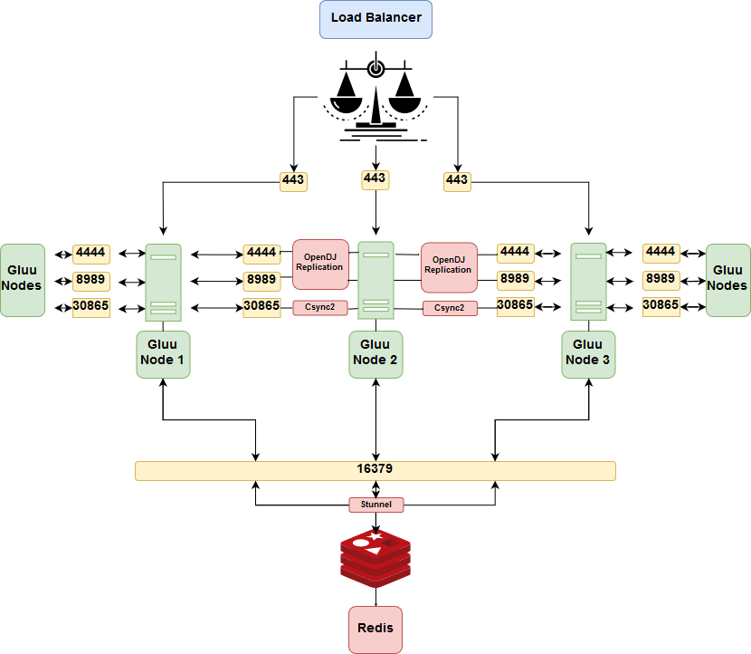

# Reference Architecture
The web tier of the Gluu Server (i.e. oxAuth) is stateless and can be scaled horizontally. The local LDAP server included in all Gluu Server deployments (i.e. Gluu LDAP) supports multi-master replication (MMR). Any instance can be written to and changes are propagated to other instances.

## Ports
The following ports are used by different components to communicate with their peers at other nodes of a cluster. Additional configuration may be needed to ensure they can be reached by incoming connections.

|Port| Application| Relation |
-----|------------- | ---
| 22 | SSH | Utility |
| 443| SSL/TLS | Load-balancer to oxAuth |
|1636| OpenDJ Conncetion| Between Gluu Servers and Cluster Manager|
|4444| OpenDJ Administration| Between Gluu Servers and Cluster Manager|
|16379| Redis Server through stunnel | From oxAuth to stunnel to Redis |
|8989| OpenDJ Replication|  Between Gluu Servers |
|30865| Csync2 Default |  Between Gluu Servers |
