# Deploying a Gluu Cluster

## Overview

This guide describes how to deploy a cluster of Gluu Servers using Cluster Manager.

## Getting Started

!!! Note
    Cluster Manager must be accessed in Chrome or Firefox.

Upon initial launch of Cluster Manager, the following screen will be presented to create an admin username and password:

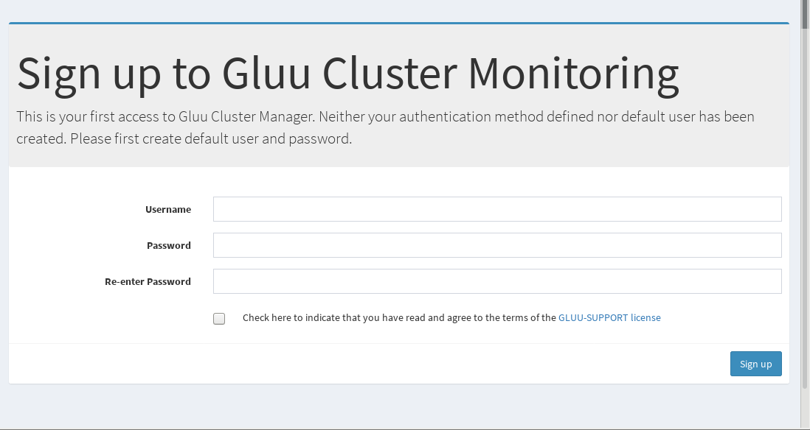

!!! Note
    Cluster Manager also supports oxd logins, see  [oxd Login](#oxd-login)

After the administrator is created, start the process of building a cluster by clicking the `Setup Cluster` button:

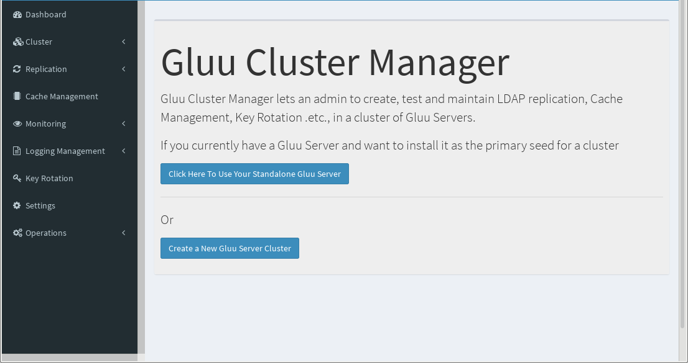

The two options are `Click Here To Use Your Standalone Gluu Server` and `Create a New Gluu Server Cluster`.

### Click Here To Use Your Standalone Gluu Server:

This method is used to take a standalone Gluu Server deployment and prepare it for clustering. This is achieved by changing the hostname of the Gluu Server to that of the load balancing server, which will act as a front-end proxy between all the Gluu Server nodes. From there, it will use the standalone server as your seed for each new server added.

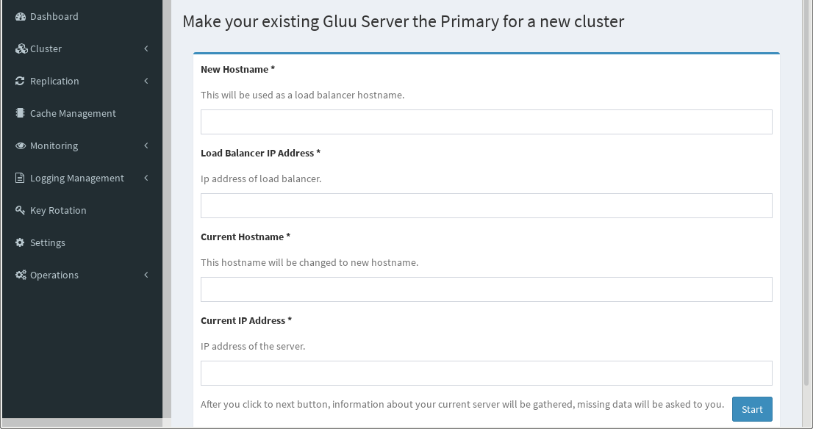

After it's finished, click the `Start` button to move on to the dashboard.

### Create a New Gluu Server Cluster:

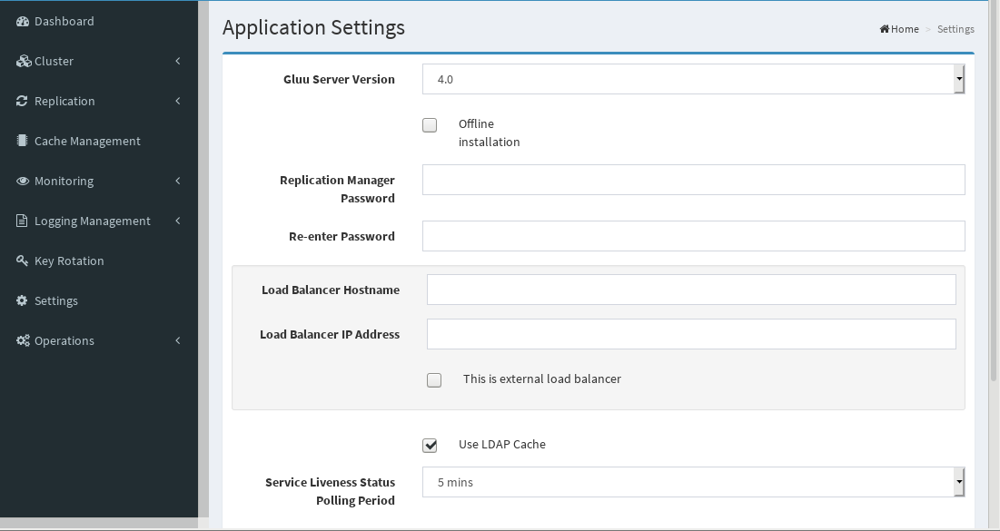

!!! Note
    If you are installing nochroot package, SeLinux should be disabled on all nodes.


- `Offline installation` Cluster Manager can install Gluu Servers and configure all servers in cluster without public internet access. If your servers don't have public internet access check this. You will put Gluu Server package(s) to `~/.clustermgr4/gluu_repo` (please refresh this page after putting package), here is a sample:

  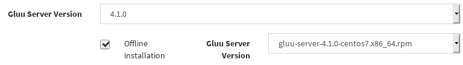

  Cluster Manager will upload selected package to nodes via ssh while installing Gluu Sever. In case you choose this option, you need to compelete [these instructions](https://github.com/GluuFederation/cluster-mgr/blob/4.2/docs/offline_install.md) which are implemented by Cluster Manager in non-offline mode.

- `Replication Manager Password` will be used in WrenDS for replication purposes. You generally won't need this password, as WrenDS replication is handled automatically, but it's useful to have on hand for operations and maintenance. It can be the same as the LDAP password 

- `Load Balancer Hostname` will be the hostname of either the NGINX proxy server, or any other load balancing server in use for the cluster. Check the `This is an external load balancer` box if you are using an external load balancer like Amazon ELB or F5 

- `This is an external load balancer` will remove the requirement for an IP address and you will only need to use a hostname here. There will be additional options here for caching; `Cache Proxy Hostname` and `Cache Proxy IP Address`. You will need to either use a cache proxy server specifically for Twemproxy to handle the multiple redis servers you deploy, _or_ you can use a Redis cluster. Cluster Manager will automatically install a Twemproxy and Redis server cache configuration for you, with Stunnel protecting communication. Using Redis cluster requires some manual configuration on your end.

- `Use LDAP Cache`, if you check this LDAP server will be used for caching. For big organizations, we suggest to use a Redis Cache Server. For Redis Cache Server uncheck this, you'll be skipping the `Cache Management` process later. **Note!** If you installed Shibboleth, Cluster Manager will use LDAP as cache provider since redis is not available as cache provider for Shibbolet at the moment. Hence this option is not available if you installed Shibboleth.

!!! Warning
    The load balancer hostname cannot be changed *easily* after Gluu Server has been deployed. Please follow [these instructions](https://github.com/GluuFederation/community-edition-setup/tree/master/static/scripts/change_hostname) for every Gluu Server in your cluster if you must change the hostname.

- `LDAP Status Check Period (mins)` is how often you would like Cluster Manager to ping the LDAP server for liveness, as can be seen in the Dashboard and Replication menus.

- If any servers do not have Fully Qualified Domain Names (FQDNs), enable the `Add IP Addresses and hostnames to /etc/hosts file on each server` option. This will automatically assign hostnames to IP addresses in the `/etc/hosts` files inside and outside the Gluu chroot 

- `Custom Schema Files` can be added here as well.

- `Upgrade` will automatically upgrade your Cluster Manager instance to the latest version. This requires you restart the instance with `clustermgr4-cli restart`. Alternatively this can be done manually with `pip install clustermgr4` and restarting Cluster Manager `clustermgr4-cli restart`.

Once the settings are configured, click the `Update Configuration button`.

A successful configuration will prompt you `Gluu Replication Manager application configuration has been updated.` at the top of the screen.

Now we should navigate to the Dashboard so we can add our Gluu Servers and prepare to connect them.

Click `Add Server`

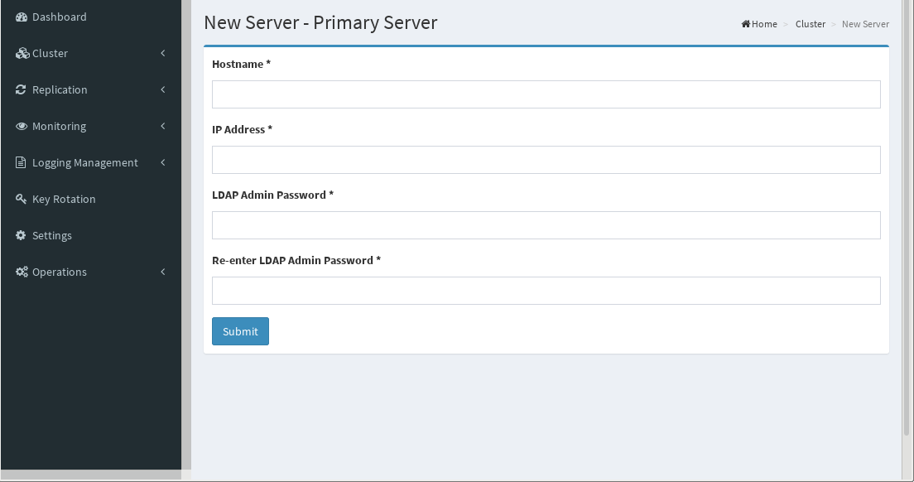

The following screen is used to add the Primary Server, which will be used as a "seed" by other nodes to pull their Gluu configuration and certificates. After deployment, all servers will function in a Master-Master configuration.

!!! Note
    Hostname here will be the actual hostname of the server, not the hostname of the Load Balancer (NGINX/Proxy) server. This is so that Cluster Manager can discover and connect to the server for installation and configuration. If the `Add IP Addresses and Hostnames to/etc/hosts file on each server` option was enabled in the `Settings` menu, the hostname here will be embedded automatically in the `/etc/hosts` files on this machine.
    
!!! Note
    For AWS deployment, use the internal IP address.

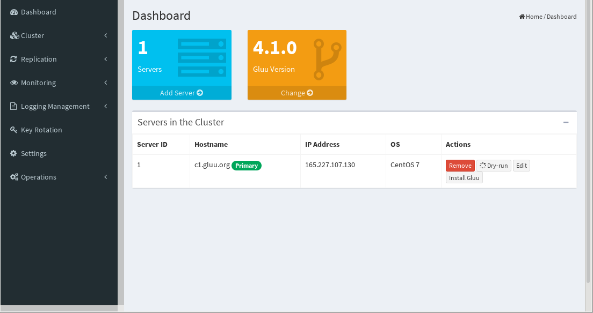

Click `Submit` to get routed to the Dashboard. OS will be displayed as **None** for newly added servers and a background process will run to determine OS. In 10 seconds OS will be displayed.

The Dashboard lists all servers in the cluster and provides the ability to add more servers, edit hostnames and IP addresses, and install Gluu automatically.

Click the `Add Server` button to add another node. 

!!! Note
    The admin password set in the Primary Server is the same for all the servers.

Once all servers have been added to the cluster, `Install Gluu` on the Primary Server.

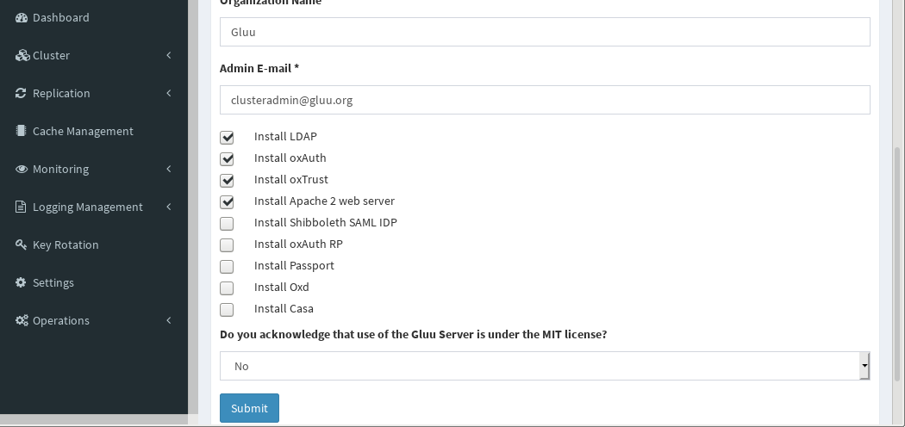

- The values for the first five fields are used to create certificates
- Next, select which modules should be installed. The default Gluu components are pre-selected. For more information on each component, see the [Gluu docs](https://github.com/GluuFederation/docs-ce-prod/blob/4.0/docs/source/index.md#free-open-source-software)
- Accept the license agreement if you agree to the terms

Click `Submit` to begin installation. 

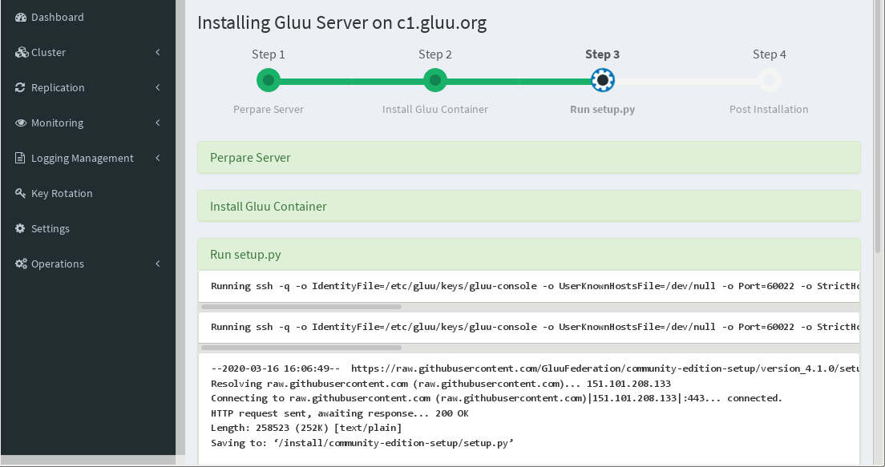

!!! Note 
    This may take some time, so please be patient.

Once completed, repeat the process for the other servers in the cluster.

When all the installations have completed, and you're not using your own load balancer, you should install Nginx:

## Installing Nginx Load-balancer

Gluu recommends use of Nginx as load balancer, but you can also use external load balancer.

When all the installations have completed, and you're not using your own load balancer, you should install Nginx:

- Navigate to `Cluster` in the left menu
- Select `Install Nginx`

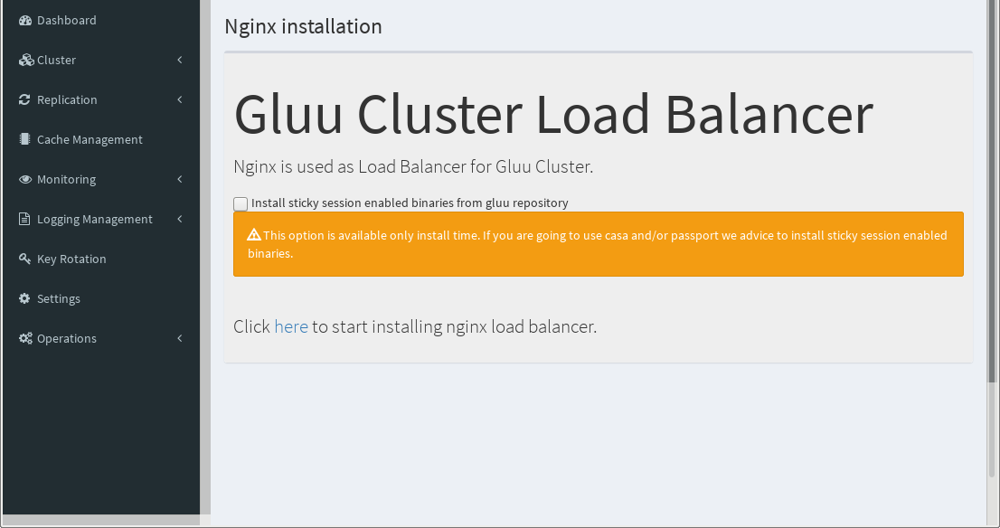

If you are going to use casa and passport, we recommend using sticky session enabled binaries from gluu repository. These binaries are compiled from source rpm and deb packages which are delivered by distributions. We included this addon https://bitbucket.org/nginx-goodies/nginx-sticky-module-ng/src as described in the doc. Please use this option at your own risc.

!!! Note
    Installation of sticky session enabled Nginx binaries are available only at install time.

To begin installation click **here** link on the page.

Finally, the `LDAP Replication` screen will appear, where LDAP replication can be enabled and disabled.  

During initial deloyment click the `Deploy All` button and wait for the process to finish.

!!! Note 
    If you are deploying offline Gluu Server 4.0, you need to replace `/opt/gluu/jetty/oxauth/webapps/oxauth.war` with https://ox.gluu.org/maven/org/gluu/oxauth-server/4.0.Final.patch1/oxauth-server-4.0.Final.patch1.war in case you will use Key Rotation feature.

!!! Warning
    Cluster manager will set `keyRegenerationEnabled` to `false`, so oxAuth won't rotate keys automatically. Instead Key Rotation is supposed to be used.

## External Load-balancers

Load balancing Gluu Server is relatively easy, there are some caveats with how connections should be made. Please refer to the [Nginx template](https://github.com/GluuFederation/cluster-mgr/blob/master/clustermgr/templates/nginx/nginx.temp#L26) for reference on how to properly route paths. For default functionality you should use the following as guidance:

- `/` should redirect to `/identity`

- `/identity`, `/passport` and `/idp` require sticky sessions. You can see this in the Nginx template as denoted by the [ip_hash](https://github.com/GluuFederation/cluster-mgr/blob/master/clustermgr/templates/nginx/nginx.temp#L7). 

There is further explanation about sticky sessions for F5 [here](https://www.f5.com/services/resources/white-papers/cookies-sessions-and-persistence) and AWS ELB [[0]](https://aws.amazon.com/blogs/aws/new-elastic-load-balancing-feature-sticky-sessions/)[[1]](https://docs.aws.amazon.com/elasticloadbalancing/latest/application/load-balancer-target-groups.html#sticky-sessions)[[2]](https://shlomoswidler.com/2010/04/elastic-load-balancing-with-sticky-sessions.html). We also have documentation on how to deploy an AWS Application Load Balancer in front of a cluster: [Configure AWS Load Balancer](../aws-config/index.md).

- `/oxauth` is stateless unless you're using SCIM, which will need sticky sessions as mentioned above.

All the necessary paths are as follows:

- /
- /.well-known
- /oxauth
- /identity
- /passport
- /idp


## Replication

Deployment of LDAP and File System replication is possible with Cluster Manager.

### LDAP Replication

Next navigate to the `Replication` tab to set up replication across the cluster. 

Click the `deploy all` button to enable LDAP replication between all the nodes in your cluster.

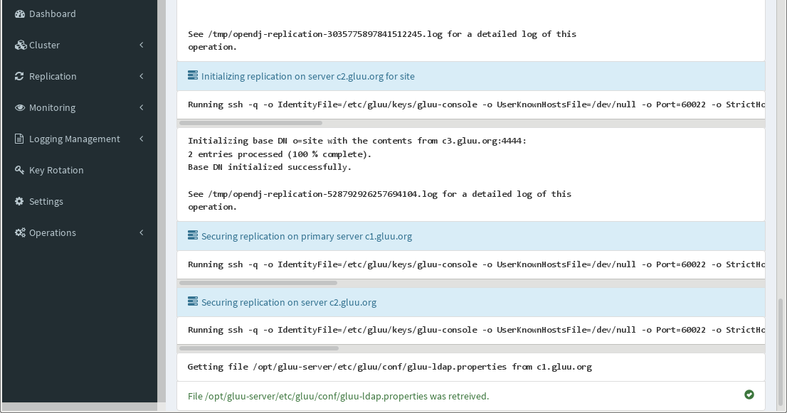

After configuring WrenDS replication for the first time, this page will display replication status and other replication information.

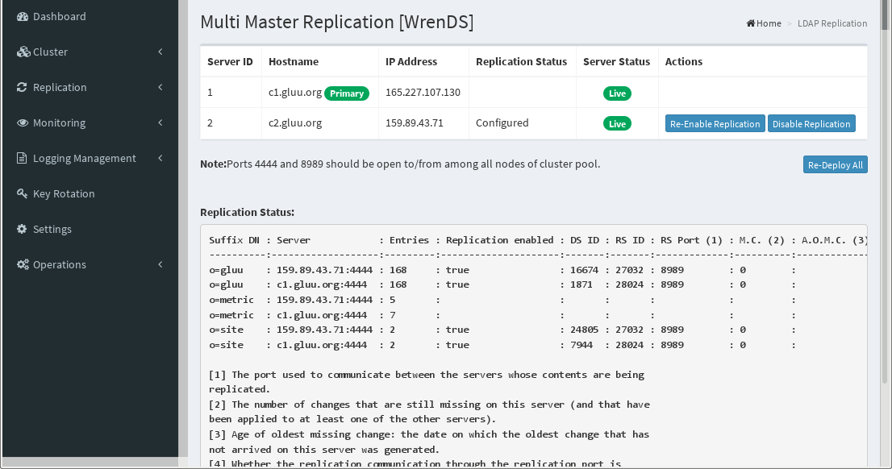

### File System Replication

If using Shibboleth, enable file system replication by clicking `Replication` on the left menu and selecting `File system Replication`. Click `Install File System Replication` to install and configure Csync2 and replicate necessary configuration files.

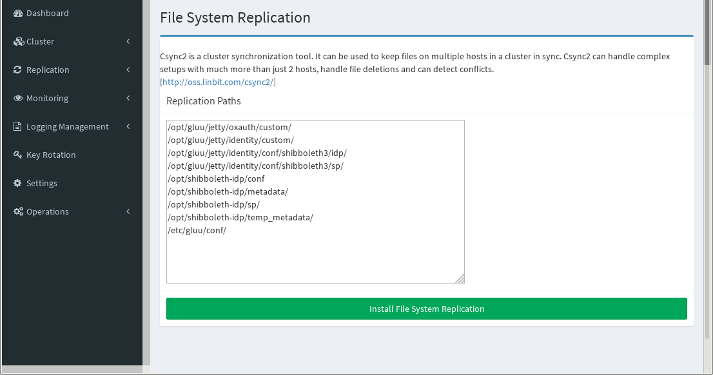

!!! Note
    If necessary, replication paths for other file systems can be added here as well. Be careful as this may lead to unexpected results if you don't know what you're doing.
    
!!! Warning
    Do not try to replicate databases with Csync2.

Navigate to `Cache Management` in the left menu to complete the cluster configuration. 

## Cache

!!! Note
    This step is not available if you are using LDAP Cache or you installed Shibboleth.

!!! Note
    If OS of your Gluu nodes is Red Hat, each node is needed to be enabled epel repo as explained [here](/docs/source/installation/index.md#install-dependencies-on-redhat-7).

oxAuth caches short-lived tokens, and in a balanced cluster all instances of oxAuth need access to the cache. To support this requirement and still enable high availability, Redis is installed outside the chroot on every Gluu Server. Configuration settings inside LDAP are also changed to allow access to these instances of Redis.

Currently Cluster Manager supports a single Redis Cache Server. To add cache server click `Add Cache Server`:

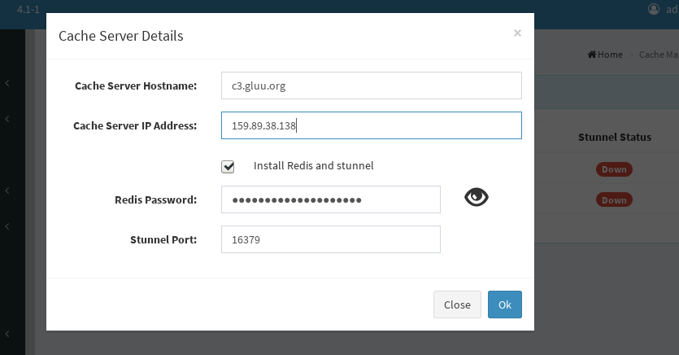

For demonstration purposes I am using Load Balancer as Cache Server, but it is highly recommended to use a seperate server. Hit `Setup Cache` to begin installation. Cluster Manager will install Redis Server on the Cache Server and make it reachable for Gluu Server nodes through stunnel (default port 16379). So stunnel will be installed on Cache Server and all Gluu Server nodes. You can restrict access to redis server by setting password. Cluster Manager creates random password for redis. If you don't want to set up password, just clear **Redis Password** box. 

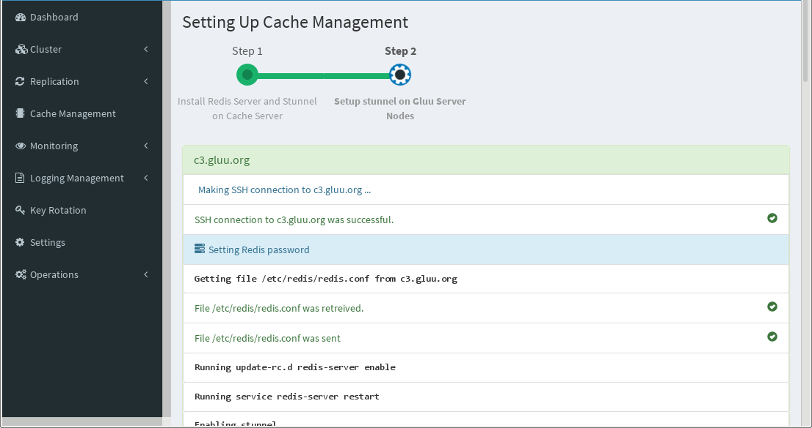

Cache configuration settings can be customized per the [component configuration](https://gluu.org/docs/cm/#default-components) documentation and also inside oxTrust.

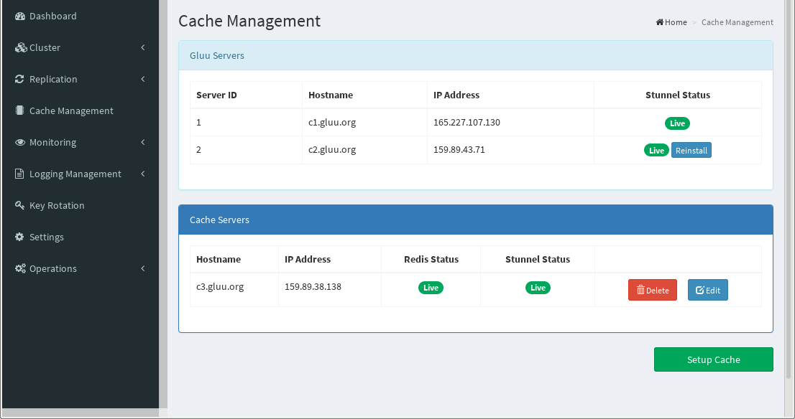

Once this task is complete, the Gluu Server cluster is fully functional. 

Navigate to the hostname of the proxy server provided in the `Settings` option.

You can also go back to the cache management screen and check the status of Redis and Stunnel. 

## Monitoring   
Cluster Manager monitors the servers in the cluster to help better understand performance and potential issues. 

!!! Note
    Cluster Manager must be connected to the cluster in order to take advantage of monitoring features. 

Navigate to the `Monitoring` tab in the left-hand menu to see details about the servers in the cluster. 

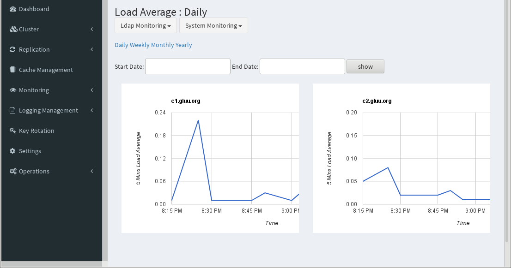

## Logging   
Cluster Manager gathers logs from all the nodes in the cluster for troubleshooting. Logs can be sorted by log type (oxAuth, oxTrust, HTTPD (Apache2), WrenDS and Redis), Host and string search filters for easy sorting. Hit `Collect Logs` after configuration to see logs.

!!! Note
    Cluster Manager must be connected to the cluster in order to take advantage of logging features. 

Navigate to the `Logging` tab in the left-hand menu to view and sort logs related to servers in the cluster. 

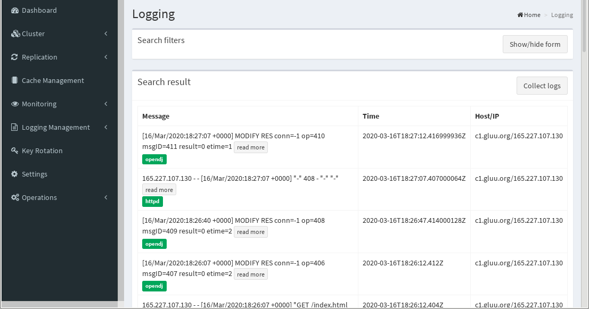

## Key Rotation

Key rotation is important for security.

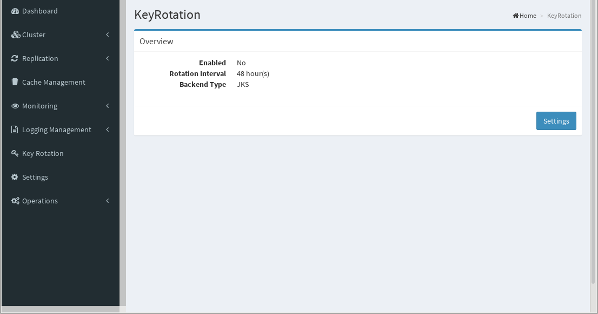

Click `Settings` to enable this functionality, as well as setting the time interval in hours.

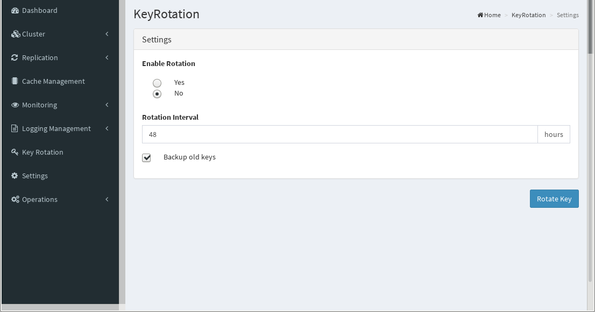

If you want to keep copies of old keys check **Backup old keys** option. This enables you keep track of your keys. Cluster Manager saves current keys to `~/.clustermgr4/backup_oxAuthConfWebKeys` in json format.

## Certificates

All fresh Gluu Server installations uses self siged certifiactes. If you want to install a valid certifiacte to your web server (all web servers in the cluster and Nginx Load Balancer), you can use **Operations/Certificates** menu. Cluster Manager will display current certificate.

## oxd Login

Cluster Manager 4.2 provides oxd external authorization. To be able to use this feature, you need an oxd server. 

### Prepare OP Server
Log in to your Gluu Server, and perform the followings

 * Navigate **Configuration/Manage Custom Scripts** and click **Dynamic Scopes** tab. Expand **dynamic_permisson**, check `Enabled` and click **Update** button
 * Navigate **OpenID Connect/Scopes** and edit **user_name**, `Check Default scope` and click **Update** button
 * Only admin and users having `clusteradmin` in their **role** (User Permission) claim will be able to login Cluster Manager. So add a user, Click `User Permission` under `gluuPerson` on the left **Available User Claims** pane. Write `clusteradmin` to the `User Permission` attrbiute as in the following figure

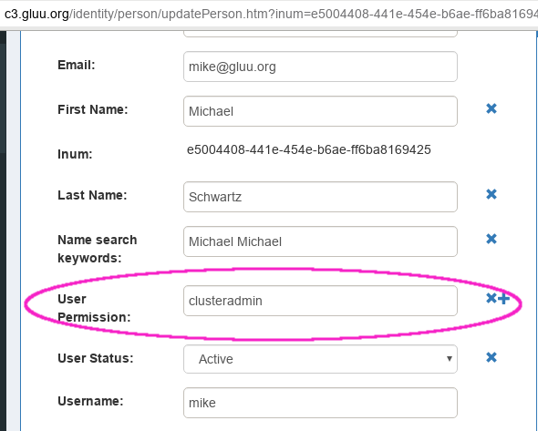

### Configure Cluster Manager

Click **Operations/Oxd Login** and fill the form as in the following figure.

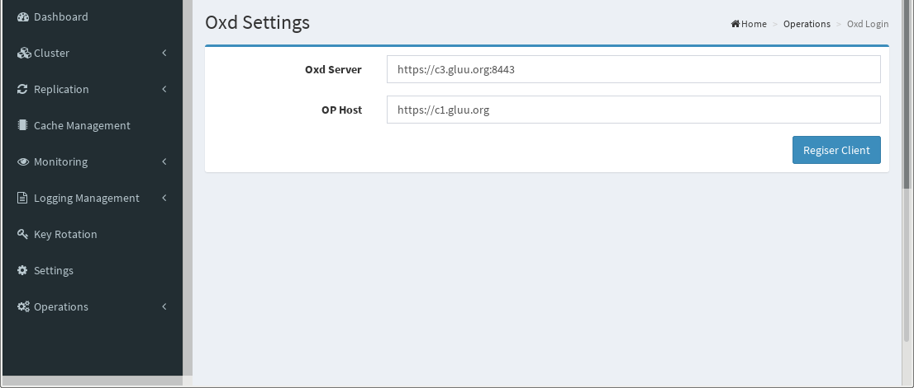

**oxd Server** oxd server URL

**OP Host** Gluu server URL

and click "Register Client". It will automatically register client on OP.

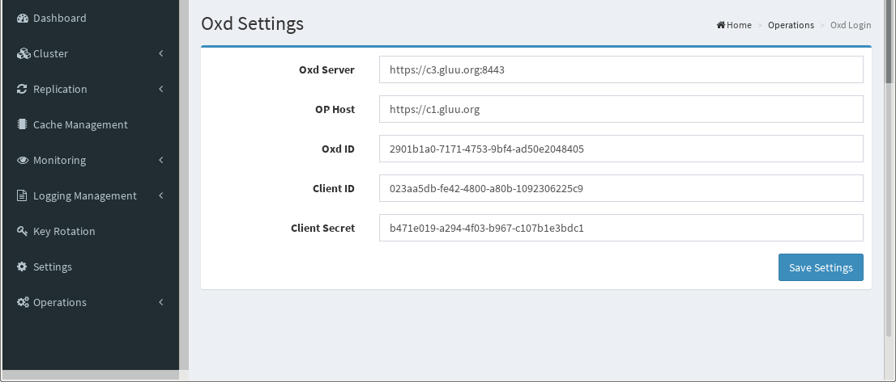

Log out from Cluster Manager. You will see `Login with Gluu Server` link. Once you click this link, you will be redirected to OP server. Log in either the **admin** user or any user having `clusteradmin` in his role. A user logged into oxd is identified as **username@openid**

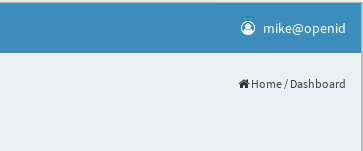

You can see who made changes in the logs. For example in `~/.clustermgr4/logs/sql.log`, user `mike` updated configuration:

```
2020-03-17 15:06:31,787 - mike@openid - DEBUG - UPDTE[AppConfiguration]: {"object_class_base": null, "cache_host": null, "nginx_host": "c3.gluu.org", "id": 1, "gluu_version": "4.1.0", "monitoring": true, "replication_dn": null, "last_test": null, "nginx_os": "Ubuntu 16", "use_ldap_cache": false, "nginx_ip": "159.89.38.138", "nginx_os_type": "Ubuntu 16", "offline": false, "external_load_balancer": false, "modify_hosts": false, "log_purge": null, "attribute_oid": 100, "gluu_archive": "", "use_ip": null, "latest_version": "4.0-6", "ldap_update_period_unit": "s", "replication_pw": "1234.Gluu", "ldap_update_period": "300", "cache_ip": null, "admin_email": null}
```


<!---
## Custom Attributes

It can be a pain to directly add custom attributes into WrenDS properly, so we've created a method to do it through the GUI. It will create a custom attribute object class that you can define and then add attributes to that object class, which you can register in oxTrust.

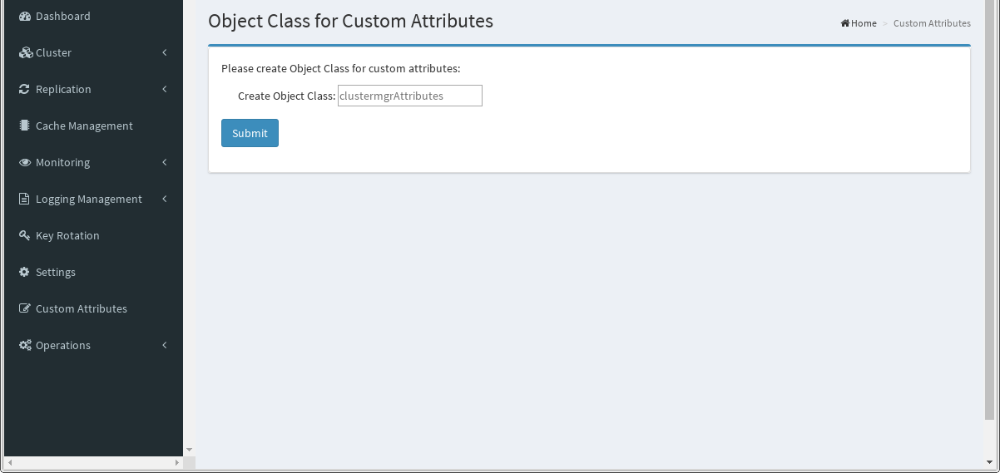

Now hit `Submit`

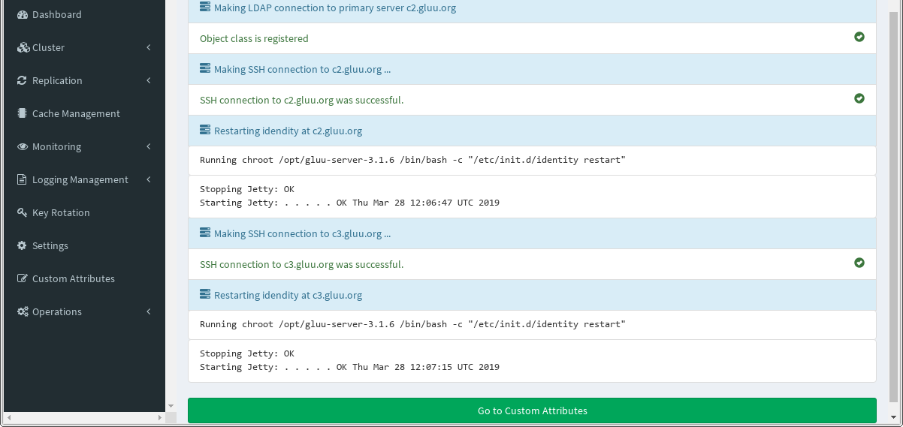

Create Custom Attribute:

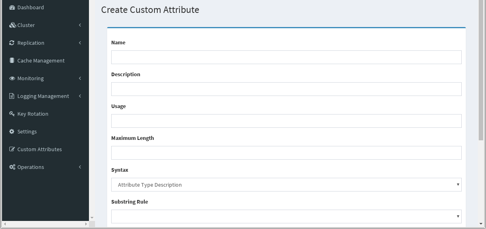

Please refer to the [LDAP Schema RFC](https://tools.ietf.org/html/rfc4519) and [this documentation](https://www.ldap.com/understanding-ldap-schema) on descriptions of LDAP schema attributes, if you're not already familiar with them.
-->
