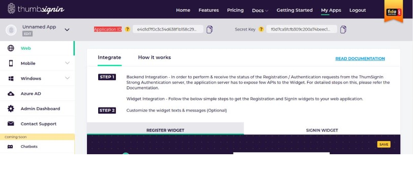
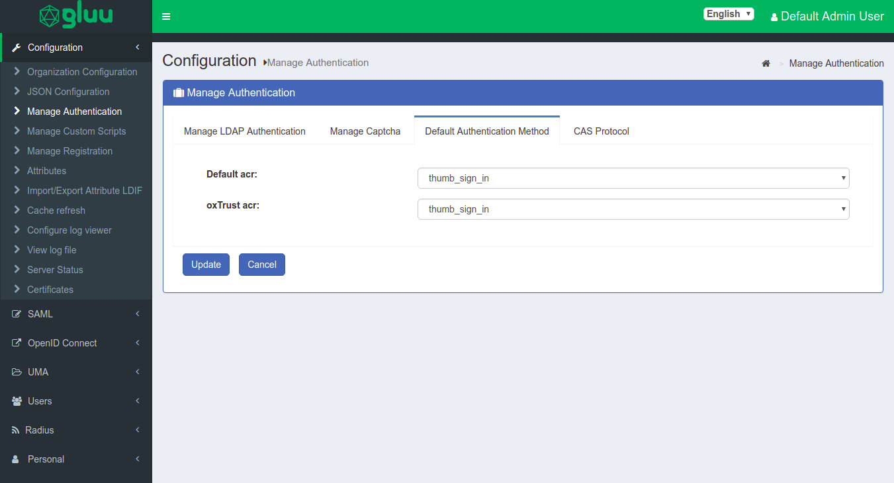
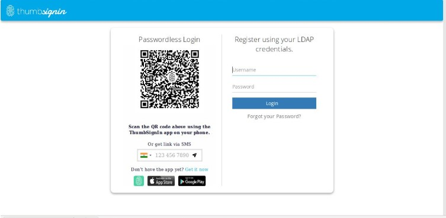

# ThumbSignIn

ThumbSignIn can be integrated with Gluu Server to achieve strong authentication for enterprise applications. The administrator of an organization can deploy the ThumbSignIn Java SDK, UI components and custom Jython script in the Gluu server.  

Here, ThumbSignIn is integrated with Gluu server as a primary authenticator to achieve passwordless login. The user will be able to log into the Gluu server with just his/her biometrics.  

The first time user can log in with his/her LDAP credentials and then can register through the ThumbSignIn mobile app. For the subsequent logins, the user can directly login to Gluu server with his/her biometric.  

## Prerequisites

 - A Gluu Server ([installation instructions](../installation-guide/index.md))
 - A ThumbSignIn interception script (found [here](https://github.com/GluuFederation/oxAuth/blob/master/Server/integrations/ThumbSignIn/ThumbSignInExternalAuthenticator.py))
 - An account with [ThumbSignIn](https://thumbsignin.com)

## Integrate ThumbSignIn with the Gluu Server

### Download ThumbSignIn UI components and Jython Script

  1. Download the UI components from [here](https://github.com/Thumbsignin/ThumbSignIn_WebPackage) and add them into the source code under `oxAuth/Server/src/main/webapp/auth/`
  1. Download the Jython custom scripts from [here](https://github.com/Thumbsignin/ThumbSignIn_JythonScript) and add them into the source code under `oxAuth/Server/integrations/`
  1. Download the ThumbSignIn java sdk jar file from [here](https://thumbsignin.com/download/thumbsigninJavaSdk) and add it into the Gluu Server's `opt/gluu/jetty/oxauth/lib/ext` folder
  
### Enable custom scripts for ThumbSignIn
  
  1. Log into the Gluu admin dashboard -> `Person Authentication Scripts` -> Click "Add Custom Script Configuration" button
  1. Add the custom ThumbSignIn interception script and select the "Enabled" option
  1. Add the following custom parameters and save the custom script configuration:
  
    
  |Property    |Status   |Description                                           |Value                                       |
  |------------|---------|------------------------------------------------------|--------------------------------------------|
  |ts_host     |Mandatory| The URL of the ThumbSignIn API server                |https://api.thumbsignin.com                 |
  |ts_apiKey   |Mandatory|These keys are required for ThumbSignIn authentication|Follow the below steps to get API key       |
  |ts_apiSecret|Mandatory|These keys are required for ThumbSignIn authentication|Follow the below steps to get API secret key|
  
### Configure ThumbSignIn Account

The `ts_apiKey` and `ts_apiSecret` key can be generated by following these steps:

  1. [Sign up](https://thumbsignin.com/) for a ThumbSignIn account
  1. Enter your email address and click `Try It`
  1. Scan the QR code displayed on your screen using the ThumbSignIn mobile app
  1. After successful registration, you'll be redirected to the home page
  1. Click `My Apps` on the menu
  1. Use the Application ID as the `ts_apiKey` parameter
  1. Use the Secret Key as the `ts_apiSecret` parameter
  
  
  
### Enable ThumbSignIn as default authentication in the Gluu Server

 Navigate in the Gluu Server UI to `Manage Authentication` -> `Default Authentication Method` and select `thumbsignin` as the Default acr, then click `update`

  
  
Go to `JSON Configuration` -> `oxAuth Configuration` and set the `sessionIDUnauthenticatedUnusedLifetime` parameter to 240 seconds
  
### Test the ThumbSignIn integration with Gluu

To test the ThumbSignIn login flow, simply navigate to the Gluu login URL. If you see the following login page, the integration was successful:

 
  
For more information about ThumbSignIn, see their [website](http://thumbsignin.com).
