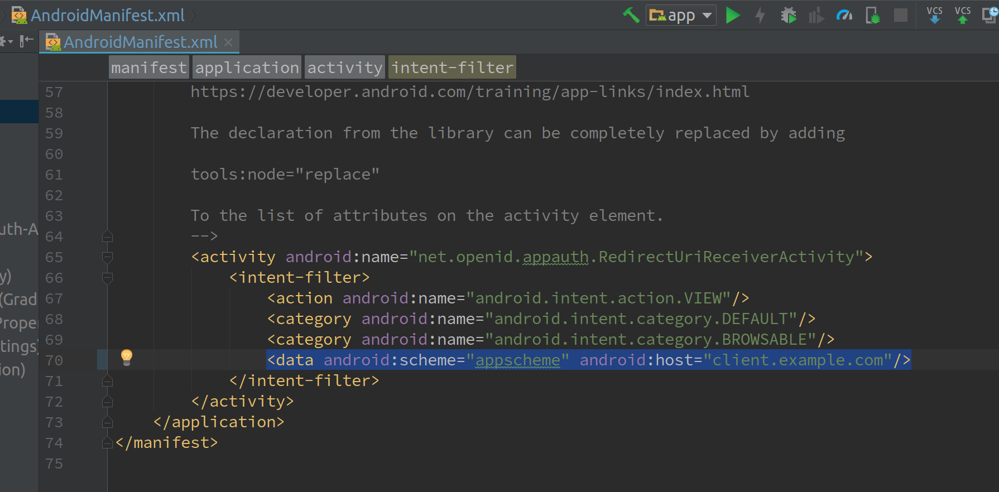
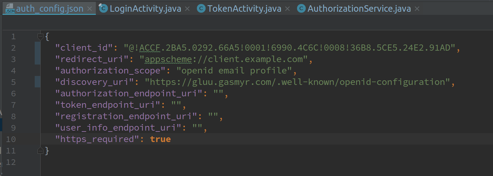
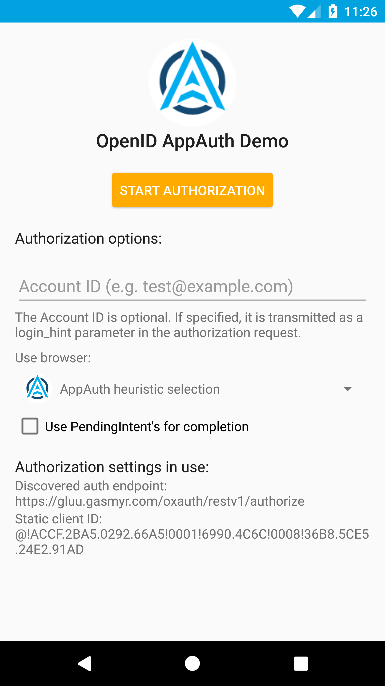
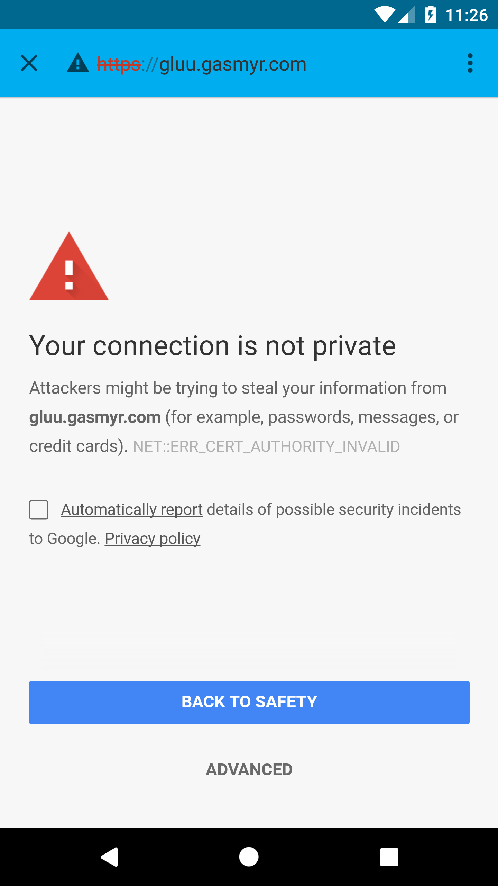
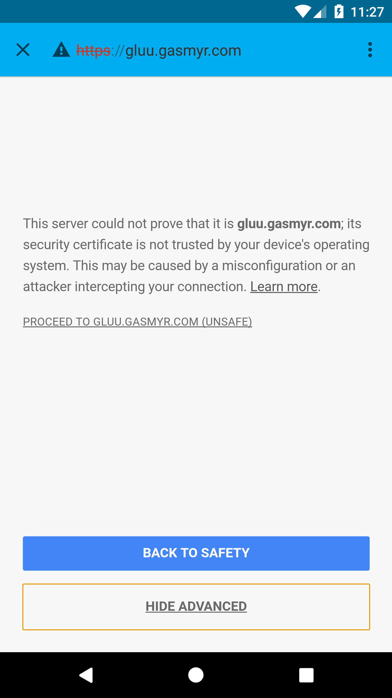
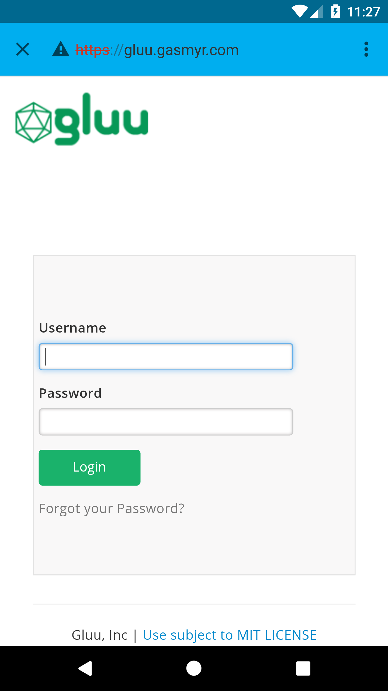
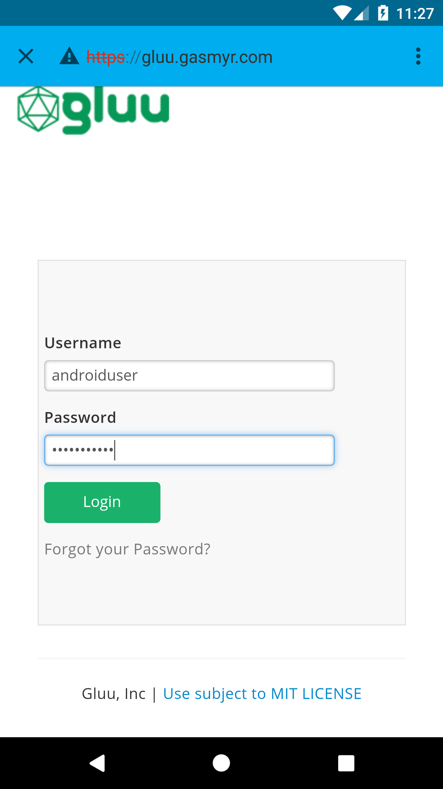
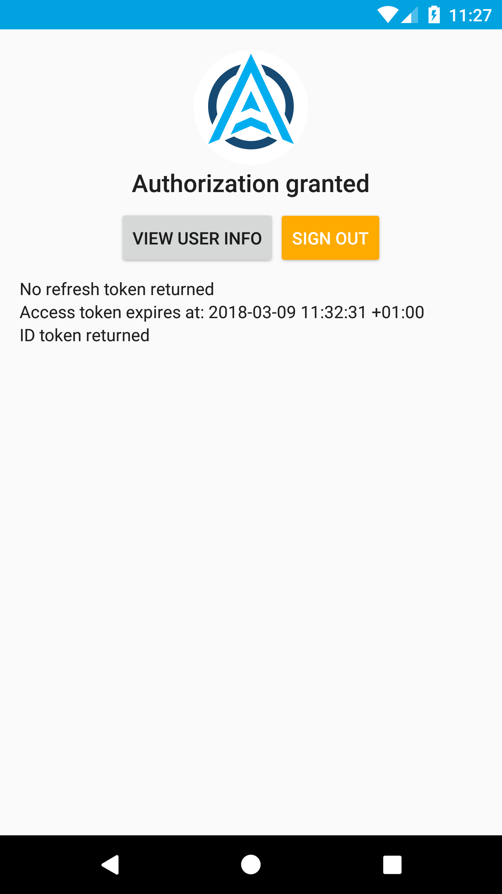

# AppAuth Android

## Prerequisite
 
   1. A Gluu Server up and running
   1. AndroidStudio with a virtual/real device (downloadable [here](https://developer.android.com/studio/index.html))
 
## Overview

AppAuth for Android is a client SDK for communicating with OAuth 2.0 and OpenID Connect providers. It directly maps the requests and responses of those specifications while following the idiomatic style of the implementation language. In addition to mapping the raw protocol flows, convenience methods are available to assist with common tasks like performing an action with fresh tokens. More information can be found [here](https://appauth.io).
 
The Gluu Server is a certified OpenId Provider and supports [Native Apps](https://tools.ietf.org/html/draft-ietf-oauth-native-apps) either through custom URI scheme redirects or app links.

You can download (or clone) the project from [Github Repository](https://github.com/openid/AppAuth-Android). The specification is also described there. It is recommended to read this specification.
  
This guide will follow these steps:

1. OpenId Client registration on the Gluu Server
1. Clone and customize the AppAuth Android demo
1. Demonstration

## Register an openId Client on the Gluu Server 

You can follow [this](https://gluu.org/docs/ce/admin-guide/openid-connect/#client-registration-configuration) documentation to add an OpenID client on the Gluu Server. The following are the required fields and their respective values:

   - Client Name: We use `AppAuthAndroidApp`, you can use whatever name you want here.  
   - Application Type: `Native` or `Web`  
   - Pre-Authorization: `False`  
   - Persist client Authorizations: `True`  
   - Authentication method for the Token Endpoint: `none`  
   - Redirect Login URIs: make sure the value provided here is a hierarchical and absolute URI. For example, if you declare a custom scheme, `myscheme`, and host, `client.example.com`, then the redirect URL will look like: `myscheme://client.example.com`. We use `appscheme://client.example.com` for our testing purpose  
   - Scopes: `openid`,`profile`,`email`  
   - Grant types: `authorization_code`  

!!! Note
    Take note of the `client_id` value after the registration. That value is required in the Android App Side and looks like this `@!ACCF.2BA5.0292.66A5!0001!6990.4C6C!0008!36B8.5CE5.24E2.91AD`.
  
If you still want to use a client secret in your app for  `Authentication method for the Token Endpoint`, you can check the official documentation by [AppAuth](https://github.com/openid/AppAuth-Android/blob/master/README.md#utilizing-client-secrets-dangerous)  

## Build and Configure the AppAuth Android Demo
 
### Build the Project

Android Studio is an official IDE for Android. You can find Android Studio and its features, docs, user guide etc. on the [Official Android Website for developers](https://developer.android.com/studio/index.html).
 
There are two ways to build an existing project: either download the source code zip file or clone the repository.
 
#### Import from the Download Source Code

If you have downloaded the source code zip file, follow the below steps to import the project in Android Studio:
 
1. Extract the source code zip file into your desired folder in your computer's file system.

1. Open Android Studio and go to `File` -> `New `-> `Import project`. It will prompt to select an existing project from your computer.

1. Browse the folder where you extracted the source code file and select the build.gradle file of the project.

    

1. Click `OK` and it will start building the project.
 
#### Clone the Project

If you don't want to download the source code manually and decide to clone the repository, follow these steps:
 
1. Open Android Studio, go to `File` -> `New` -> `Project from Version Control`
-> `Git`.

    

1. Fill in the following details, then click `Clone`.
 
    - Git Repository URL: Repository URL that you want to clone
    - Parent Directory: Folder location in which you want to store the project in your computer
    - Directory Name: Project Name
    

1. It will clone the repository into the folder you mentioned in `Parent Directory` above and start building the project.
 
If you get an error like: "Error:Could not find com.android.support:customtabs:26.0.1.", be sure you have installed the Android Support Library from the Android SDK Manager. Follow the Android Studio prompts to resolve the dependencies automatically.
 
Once the project builds successfully, you can see that there are two modules in the project.
 
- App(Demo app which use AppAuth library)
- Library(AppAuth library project)

### Configuration  

#### Modify the `RedirectUriReceiverActivity` File

After completing authorization in the custom tab, the above custom scheme will redirect you back to the app. The library configures `RedirectUriReceiverActivity` to handle a custom scheme. Add the following in your `AndroidManifest.xml` file:
 
```xml
    <activity android:name="net.openid.appauth.RedirectUriReceiverActivity">
        <intent-filter>
            <action android:name="android.intent.action.VIEW"/>
            <category android:name="android.intent.category.DEFAULT"/>
            <category android:name="android.intent.category.BROWSABLE"/>
            <data android:scheme="YOUR_CUSTOM_SCHEME"
                android:host="YOUR_REDIRECT_HOST"/>
        </intent-filter>
    </activity>
```

Example here:

 
#### Modify the `auth_config.json` File

Replace the `auth_config.json` file, located at `app/res/raw/auth_config.json,`
with the following content:
 
```json
{
  "client_id": "Put ClientId obtained from registration here",
  "redirect_uri": "Put custom scheme redirect_uri here",
  "authorization_scope": "openid email profile",
  "discovery_uri": "<IDP hostname>.well-known/openid-configuration",
  "authorization_endpoint_uri": "",
  "token_endpoint_uri": "",
  "registration_endpoint_uri": "",
  "https_required": true
}
```

 
_If you keep client_id blank, it will Automatically initialize the "**Dynamic client registration**" process mentioned above._
 
## Demonstration

- Make sure there is a user register in Gluu server that you can use to test the application.
Use Oxtrust GUI to do that.
- Launch the app from Android Studio:
  You will see this screen:



- Click the `START AUTHORIZATION` button:
  That will redirect you to your gluu instance login page





- Provide the user credentials and hit the `login` button
  The result is something like this:


 
 
