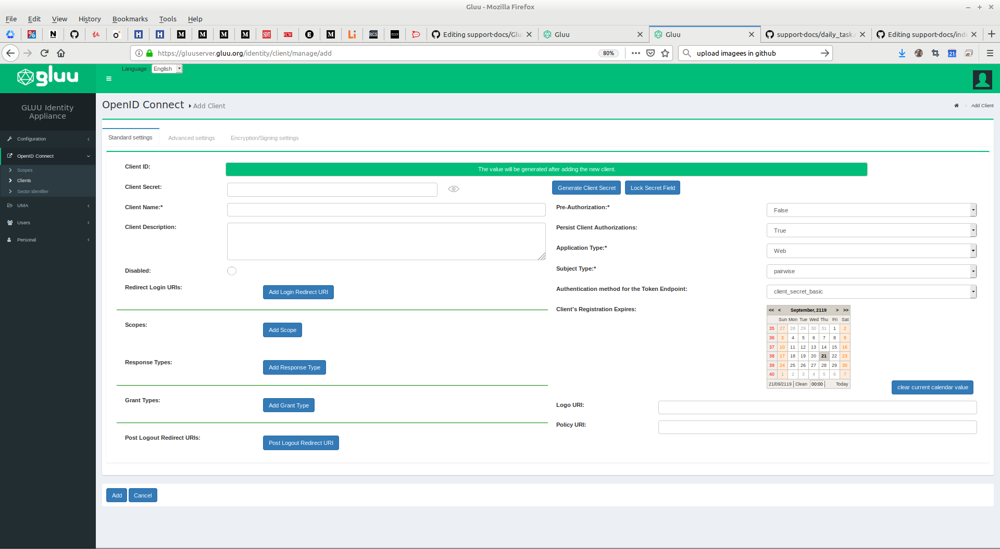
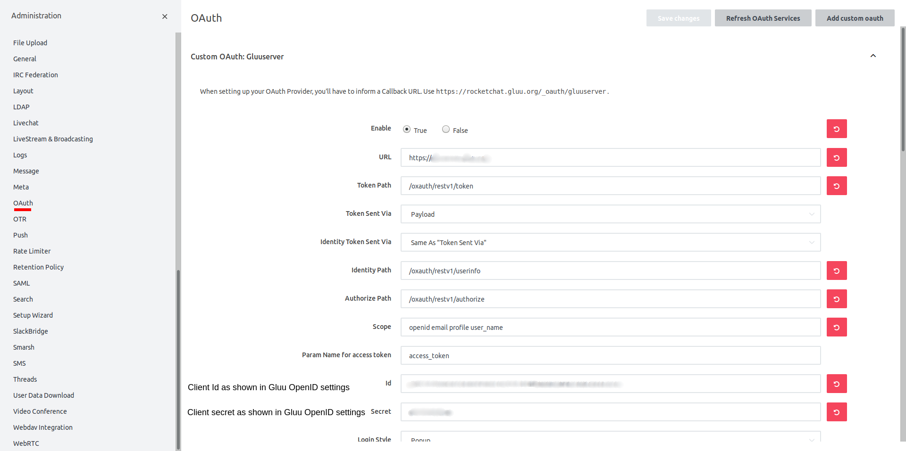
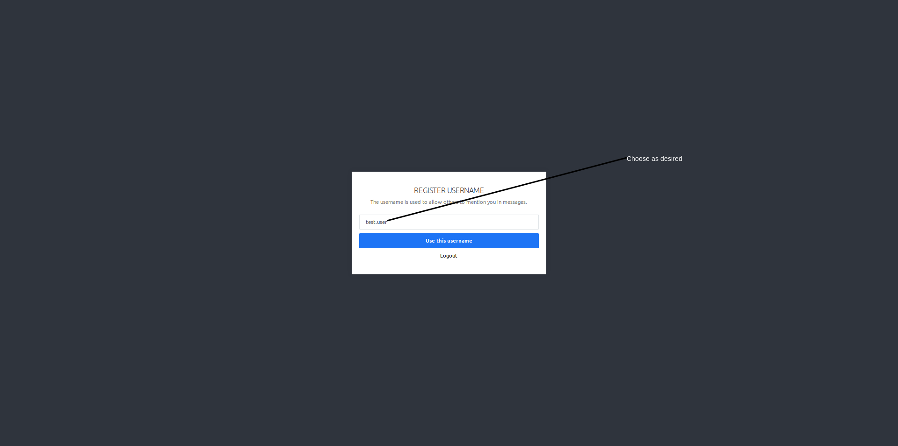
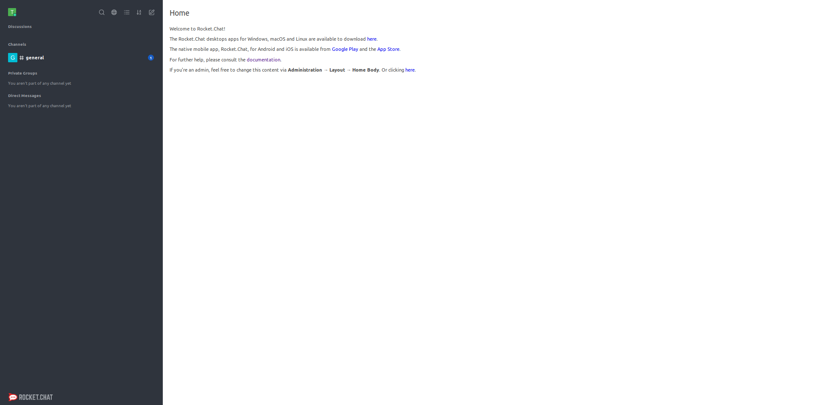

# Single Sign-On (SSO) to Rocket Chat

## Overview
This doc will guide you on how to setup a Gluu Server as your identity provider (IDP) for access to Rocket Chat. By using a Gluu Server as your IDP, you can bypass the process of storing passwords in Rocket Chat. 

## Requirements

- An operational Gluu Server installation 
- An operational [Rocket.Chat](https://rocket.chat) installation
- A user with administrative privileges in each application 

## Note
 
When adding the Gluu Server OAuth client to Rocket Chat (described [below](#rocket-chat-configuration)), the server title is converted to lowercase, and hyphens, spaces, etc. are removed. So for example, `Gluu Server` or `Gluu-Server` will be converted to `gluuserver`. And then at the top of the page, the following message is generated:

> When setting up your OAuth Provider, you'll have to inform a Callback URL. Use `https://{your_rocketchat_url_accessible_from_gluu_server}/_oauth/gluuserver`

During creation of your client in the Gluu Server, this URL is used as the `Redirect Login URI`. 

## Gluu Server Configuration

In oxTrust, navigate to `OpenID Connect` > `Client` and click `Add Client`. You'll see the following form to create the client for Rocket Chat:  

- The `Client ID` is generated automatically.
- Keep sufficiently strong `Client Secret`.
- Add optional `Client Description`.
- Add `Redirect Login URIs` (use the **Callback URL** from Rocket Chat as [noted above](#note))
- Add at least the following scopes `Scopes`: **email**, **openid**, **profile** and **user_name**.
- Add the following `Response Types`: **code**, **token**, **id_token**.
- Add the following `Grant Types`: **authorization_code**.
- Set `Pre-Authorization` to **Yes**
- Set `Application Type` to **Web**.
- Set ` Authentication method for the Token Endpoint` to **client_secret_post**.

After completing these fields, click the `Add` button. 

The configured client should look similar to this:

## Configuring Rocket Chat
 
In rocketchat Administration area, find the page for `OAuth` and click `Add custom oauth`. 

Add a name for your server, we called ours: `Gluu Server`.

- Set `Enable` to **True**.
- Add the `URL` of your Gluu Server.
- Add `Token Path` as **/oxauth/restv1/token**.
- Add `Identity Path` as **/oxauth/restv1/userinfo**.
- Add `Authorize Path` as **/oxauth/restv1/authorize**.
- Add `Scope` as **openid email profile user_name**
- Add `Id` from the client created in your Gluu Server.
- Add `Secret` from the client created in your Gluu Server.
- We chose `Button Text` as **Gluu OpenID**.
- `Login Styles` is a matter of choice.

Once you set all the parameters and save the changes, the screenshots look like below two screenshots.

## Testing
Access your Rocket Chat server and you should see two options to login: username and password and the custom text you just added, e.g **Gluu OpenID**. 

This is shown as below:

After we click the link, e.g. Gluu OpenID, we're redirected to the Gluu Server for login. We had created a test user, so we added the username and password as shown below:

Once authentication is complete, we're redirected back to Rocket Chat where we're asked to create a new username. It's purely a matter of personal choice. We chose to keep it the same, i.e **test**. 

See the screen below asking us to provide the username:

Once done, we're granted access to Rocket Chat.

