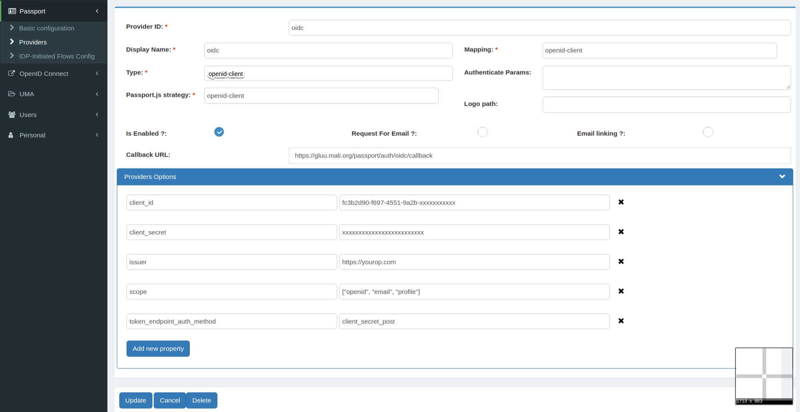

# Inbound identity using Openid-client

This tutorial offers a step-by-step guide to integrate your external OP Server using [openid-client](https://github.com/panva/node-openid-client). Especially tutorial covers the `private_key_jwt` token endpoint auth method.

## Pre-requisites

- No previous knowledge of [passport](../authn-guide/passport.md) (the key Gluu server component for inbound identity) is required to follow this document, however, it is assumed your Gluu server has Passport already [enabled](../authn-guide/inbound-oauth-passport.md#enable-passport).

- Ideally, your external OP Server discovery endpoint should be publicly accessible to the Internet. This is due to `openid-client` processes. which hit the discovery endpoint to fetch all your external OP Server configuration.

- Required your external OP Client credentials, `client_id` and `client_secret`
        
## Add openid-client identity providers

In this section, we'll onboard Apple to the list of known providers for inbound identity.

1. Log in to oxtrust UI with an administrative user
1. Go to `Passport` > `Providers` and click on `Add new provider`
1. For provider ID, enter `oidc`. If you want to use a different ID, you'll have to change the redirect URL in your provider OP Server.
1. Enter a Display Name (eg. `oidc`)
1. For type choose `openid-client`
1. For strategy enter `openid-client`
1. For mapping enter `openid-client`
1. Supply a logo location if desired. More info [here](../authn-guide/passport.md#about-logo-images)
1. Enter the `client_id`, `client-secret`, `issuer`.
1. Default `token_endpoint_auth_method` is `client_secret_post`. Set `private_key_jwt` for `Private Key JWT` flow. You have to enable this same method at your external OP.
1. Click on `Add`

Here is an example of how the form might look:



After `Add`, it will create JWKS keys at `/opt/gluu/node/passport/server/jwks/[provider_id].json`. It will look like below:

```json
{
    "keys": [
        {
            "e": "AQAB",
            "n": "vPVxjxxxxxx...GpnQIKTpdQ8Au5Fxw",
            "d": "FAPzuXLY_xD5TWm65oSxxxxx....m-iYSmQPIrubbycQ",
            "p": "3wgAAjAOSibj--LxNfnxxx...bF3NETvPQmT7k8Bx0nr4zViAWhK-en-XxSd8PrSBqeCX0g-s",
            "q": "2OQQjzDmj25WWqql5AmIgT6xxxxx....FU9bhavwS2Y5EAipyrcotyKiByDrc41vqekKAffe-pU",
            "dp": "WxTdTAdsDoRLXraTY0OwxkhtfOS3xxx....OgcbZn-U_CwUJ2gZIq-88jHhPTae2szElyeNWM_k",
            "dq": "WgARawnUsrILfWYQnpbiIReMotWfBE8xxxx....1Tc2u1tX6QvbgceCy065uFK88uzDmwICB0",
            "qi": "QlA3QVPOYtC9N8aKN3iOdSrymWwySFdPNQzAvxxxx.....8tc9sgieT6SFL74-KKLa5CCOdTYRGQ",
            "kty": "RSA",
            "kid": "E9VcpIeTlkbFuXg6qxx....R85BhOGziDH43cE"
        }
    ]
}
```

You just only need to take the public key from above json, make a new json like below example and set it to your external OP. If you are using Gluu CE as a external OP then go to `OpenID Connect > Clients > Open Your Client > Encryption/Signing settings > JWKS`, add below JSON in `JWKS` field and update client.

```json
{
    "keys": [
        {
            "e": "AQAB",
            "n": "vPVxjxxxxxx...BIEkTmaxNpG-a9BtqU8Lw",
            "kty": "RSA",
            "kid": "E9VcpIeTlkbFuXg6qxx....R85BhOGziDH43cE"
        }
    ]
}
```

Done, You configured provider and enabled `private_key_jwt` token auth method.

## Test

Set passport's logging level to debug. You can revert to *info* or other when you are done with your tests. In oxTrust go to `Passport` > `Basic configuration` and change `Log level`.

You can use any OIDC client app protected by Gluu to test. To do so, ensure to pass `passport_social` for `acr_values` in your authentication request. Actually, you can leverage oxTrust to do this: go to `Configuration` > `Manage authentication` and set `oxTrust acr` to `passport_social`. Then logout.

Attempt to login to the application. You will see `oidc` listed on the right-hand panel. Click on it to trigger the flow. You will be taken to your external OP provider to enter your credentials and then returned to the application with access to it.

Did something go wrong?

- Double-check all configurations were applied accurately
- Check `passport.log` (find it at `/opt/gluu/node/passport/logs`)
- Open a support ticket
