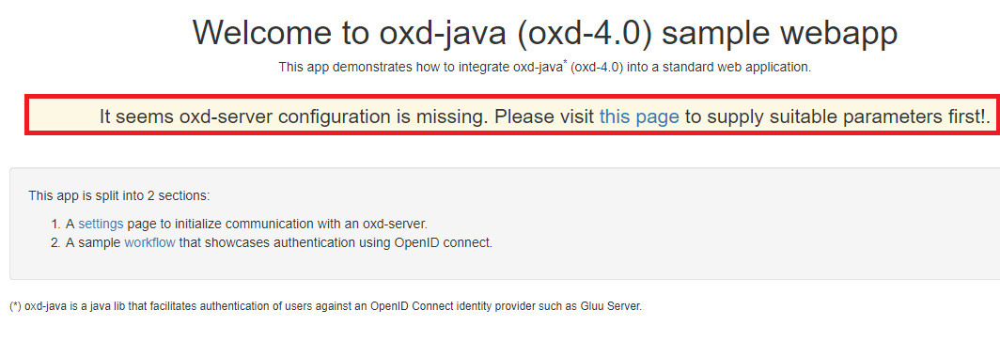
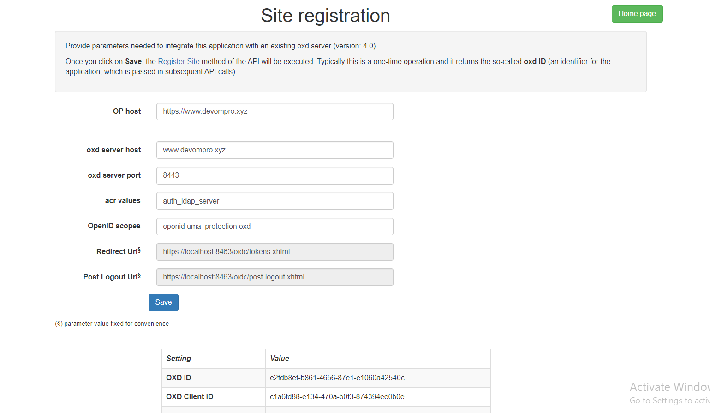
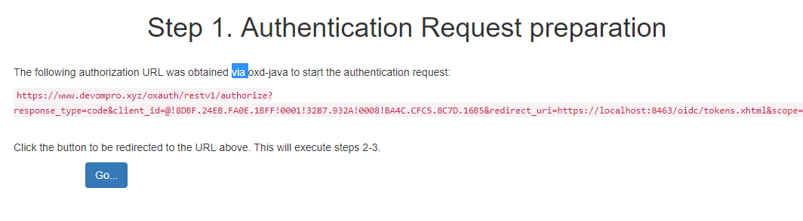
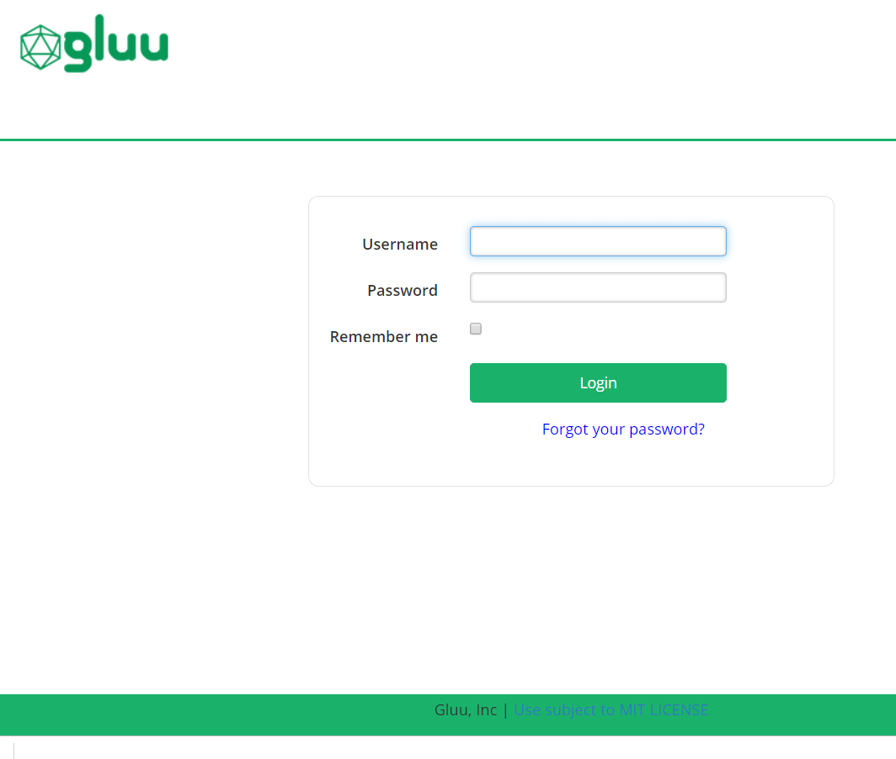
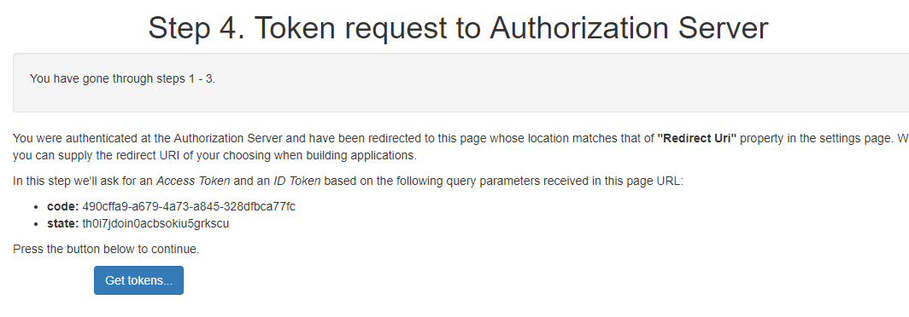
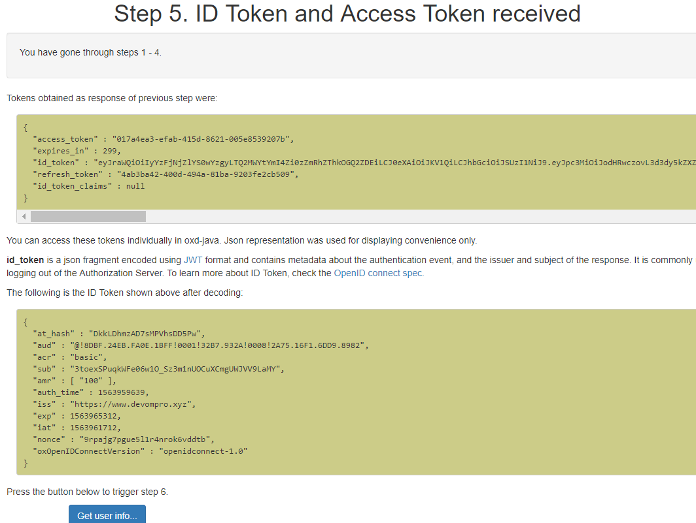
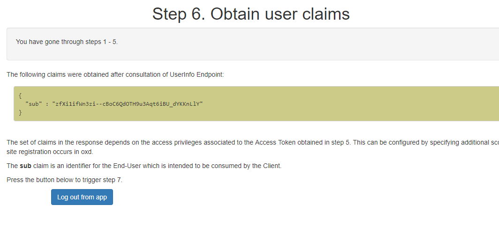

# oxd tutorial - Java

In this tutorial we demonstrate how a java web application can leverage oxd for SSO using the [authorization code flow](https://openid.net/specs/openid-connect-core-1_0.html#CodeFlowAuth).

## Overview

A Java web project showcasing how to integrate the library and the step-by-step process of OpenID Authentication can be found in [this repo](https://github.com/GluuFederation/oxd-java-sample/tree/version_4.1).

The demo app uses standard well-known technologies included in the Java EE 7 web profile. No other frameworks are used in order to facilitate the understanding of project structure as well as its code.

## Prerequisites

1. Java 8+

    Install [Java Standard Edition](http://www.oracle.com/technetwork/java/javase/downloads/2133151) version 8 or higher.

1. Maven 3+

    Download [maven](https://maven.apache.org/download.cgi) and follow the simple installation instructions. Ensure the `bin` directory is added to your PATH.

1. Install [Gluu Server bundled with oxd](../../install/index.md).

## Run

1. Ensure that Gluu server and oxd-server are running and accessible.

1. Clone `oxd-java-sample` project from [Github](https://github.com/GluuFederation/oxd-java-sample) to your local disk

    If you have `git` installed, just open a console and run below command to clone the project.

    ```
    git clone https://github.com/GluuFederation/oxd-java-sample.git
    ```

1. Issue the below command to start the app

    ```
    mvn jetty:run
    ```
   
   To allow the application to trust all certificates issue the below command to start the app.
   
    ```
     mvn jetty:run -Dtrust.all.client=true
    ```


    Depending on connection speed and computer performance, it may take a couple of minutes to complete. It is downloading all required dependencies and performing initial configurations.

    The project is ready to go once the console displays a message like ... `INFO:oejs.Server:main: Started @XXXms`. Open a browser and point to https://localhost:8463/.

## Configurations

When the app is starting, it will try to automatically interact with an available oxd-server and attempt to register a site. It does so by searching for connection parameters in local disk, Java system properties or just assuming typical default values.

If no site registration was possible upon start, the UI of the app will display a warning stating that action needs to be taken and will present a form to provide the required values.



### Site Registration

The form will be already populated with some default values. After completing the form, click `Save`. This action will trigger [site registration](https://gluu.org/docs/oxd/api/#register-site) and will display `OXD ID`, `OXD Client ID`, `OXD Client secret` and `OXD Client name` on the screen (as shown in figure below)



Every time a Site Registration is successfully performed by means of the UI, the settings are saved to disk (in a temp directory of your OS). This way there is no need to re-enter info after subsequent restarts.

### Wokflow

After completing site registration go back to Home page and click on `workflow` link on step 2. This will bring you to another page listing out the steps that will be followed in this typical flow. Click on the `Start` button to start workflow.

#### Step 1 : Authentication Request preparation

In this step web application will obtain authourization URL to which application must redirect to start the authentication process at  OpenID Connect Provider. 



#### Step 2 : Client sends the request to the Authorization Server.

The authourization URL obtained in step 1 is displayed on screen and on click of `Go` button the application is redirected to this url and  OP login page is displayed.



#### Step 3 : Authorization Server authenticates the End-User and sends them back to the Client with an Authorization Code.

User enters `username` and `password` and submit in OP login page. Authorization Server authenticates the End-User and sends him back to the Client with an Authorization code.

#### Step 4 : Token request to Authorization Server

In this step the web application requests authorization Server for access token through oxd-server. On click of `Get tokens` button application pass `code` and `state` values to the oxd server and obtain an access token from OP.



#### Step 5 : ID Token and Access Token received

The access token received from step 4 is displayed on screen. To obtain user claims using the Access Token click on `Get user info` button. The user claims is fetched from OP host using the generated access token.



#### Step 6 : Obtain user claims

In this step the user claims fetched from OP server is displayed on screen. There is a `Logout from app` button at the bottom to trigger 
generation of Logout URL where you can redirect the user's browser to initiate the logout process.



#### Step 7 : Logout

This is the final step in this worflow in which client logs out user from the application and from the Authorization Server. For this, a logout URL is obtained and End-User's browser is redirected to such location. Then OP will make the browser return to a predefined "Post Logout Uri" that was supplied (or set) during site registration.

!!! Note
    In oxd-server if `protect_commands_with_access_token` is set to `true` in oxd-server.yml, then all the API operations  (except Register Site) must be protected by an client access token. [Get Client Token](../../api/#get-client-token) allows you to obtain such a "client access token".

## API and Code Reference 

To show how this [sample java application](https://github.com/GluuFederation/oxd-java-sample/tree/version_4.1) implements oxd apis to complete above sso steps, we have mapped the steps with Api and Code reference in below table.

S.No. | Description | API | Code Ref. from Project (in [OxdService](https://github.com/GluuFederation/oxd-java-sample/blob/version_4.1/src/main/java/org/gluu/oxd/sample/bean/OxdService.java) class)
------|-------------|-----|-------------------------
1 | Site Registration : The purpose of Register Site is to register a new OpenID Client at your OP. | [register-site](../../api/#register-site) | method `doRegistration`
2 | Get Client Token : When you set `protect_commands_with_access_token` to `true` in oxd-server.yml, all API operations (except Register Site) must be protected by an client access token. Get Client Token allows you to obtain such a "client access token" very easily. | [get-client-token](../../api/#get-client-token) | method `getClientToken`
3 | Get Authorization Url : This operation returns a URL to which your application must redirect the user's browser to start the authentication process at the OP. | [get-authorization-url](../../api/#get-authorization-url) | method `getAuthzUrl`
4 | Get Tokens By Code : After authentication, the OP sends the user's browser back to the `redirect_uri` page with a couple of query parameters in the URL: `code` and `state`. Use those to issue a call to this API operation. As a response, you will get an access token | [get-tokens-by-code](../../api/#get-tokens-id-access-by-code) | method `getTokens`
5 | Get User Info : Use this operation to obtain user claims (e.g. first name, last name, e-mail, etc.) about the authenticated end-user. | [get-user-info](../../api/#get-user-info) | method `getUserInfo`
6 | Get Logout Uri : Use this method if you intend to log the user out of the OP. This will return a URL where you can redirect the user's browser to initiate the logout process. | [get-logout-uri](../../api/#get-logout-uri) | method `getLogoutUrl`

## Support

Please report technical issues and suspected bugs on 
our [Support Page](https://support.gluu.org/).
