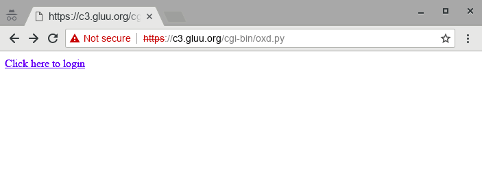
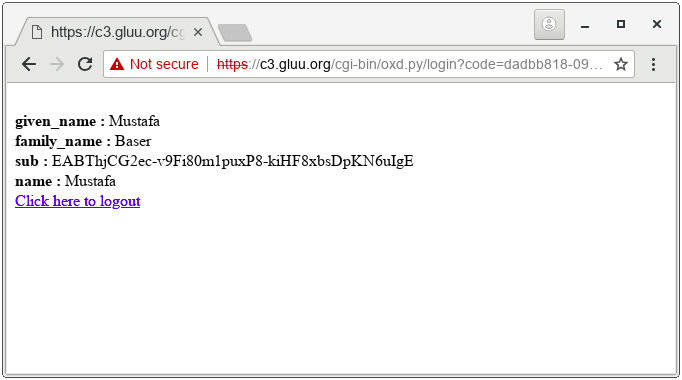

# oxd tutorial - Python

In this tutorial I explain how to leverage the oxd server for SSO using the OpenID Connect [authorization code flow](https://openid.net/specs/openid-connect-core-1_0.html#CodeFlowAuth), and Python CGI and Apache.

## Preliminary

For this tutorial, our OpenID Connect Provider (OP) is Gluu Server 4.2. We are also using oxd 4.2 and an https & cgi enabled web server -- Apache in our case. 

### Gluu Server 4.2 (OP)
As stated above, in this tutorial we're using Gluu Server 4.2 as the OP. 

- Follow [these instructions](https://gluu.org/docs/ce/4.2/installation-guide/install/) to install Gluu Server 4.2. In this tutorial, I installed Gluu Server on host **op.server.com**.

- Add a test user. I added user `test_user`.

### oxd Server 4.2
To install oxd Server 4.2.0, follow [these instructions](../../install/index.md). 

For this tutorial, I installed oxd Server on its own host, **oxd.server.com**. For testing purposes, oxd can also be installed on the same server as the Gluu Server if needed, as there are no port conflicts.

My **defaultSiteConfig** section of `oxd-server.yml` configuration is as follows:

```
defaultSiteConfig:
  op_host: 'https://op.server.org'
  op_discovery_path: ''
  response_types: ['code']
  grant_type: ['authorization_code']
  acr_values: ['']
  scope: ['openid', 'profile', 'email']
  ui_locales: ['en']
  claims_locales: ['en']
  contacts: []
```

### Apache Web Server (RP)

Since we are going to write a cgi script for simplicity, we first need to get a working
web server to act as the Relying Party (RP). Apache will be installed on the host **rp.server.com**. I am using Ubuntu 16.04 LTS for this purpose. First install apache web server:

```
sudo apt-get update
sudo apt-get install apache2
```

Enable ssl, cgi and https:

```
sudo a2enmod cgi
sudo a2enmod ssl
sudo a2ensite default-ssl.conf
```

Restart apache:

```
service apache2 restart
```

We will use Python's requests module to interact with oxd's REST API:

```
sudo apt-get install python-requests
```

## Steps for SSO 

These are the steps that will be performed for SSO; step numbers map the steps in the cgi script:

Step | Explanation | Endpoint
-----|-------------|----------
1 | Creating a client on Gluu server and registering your site to oxd Server  (we will do this dynamically, for clarity's sake, though it is possible to automate this step in the cgi script). In this command `redirect_uris` provides list of Redirection URIs used by the Client. The first URI from this list is where the user will be redirected after successful authorization at the OpenID Connect Provider (OP). | [register-site](../../api/#register-site)
2 | Obtain an access token from the oxd server. This token will be used in headers to authenticate to oxd server in all subsequent queries. I will call this the`oxd_access_token`. So, with the exception of this step headers of subsequent queries will be: <br> `Content-type: 'application/json` <br> `Authorization': 'Bearer <oxd_access_token>'` | [get-client-token](../../api/#get-client-token)
3 | Get authorization url. Users will click on this url to reach Gluu's login page and will be redirected to `redirect_uri`. If `redirect_uri` not provided in request parameter of this command then it will redirect to the first URL from `redirect_uris` (passed during client registration). | [get-authorization-url](../../api/#get-authorization-url)
4 | You need to verify the `code` and `state` values returned by browser to your cgi script after authorization by Gluu Server. You can pass these values to the oxd server and obtain an access token to user's claims. | [get-tokens-by-code](../../api/#get-tokens-id-access-by-code)
5 | Query user information and display it on page. | [get-user-info](../../api/#get-user-info)
6 | Query the logout uri from the oxd server. | [get-logout-uri](../../api/#get-logout-uri)

## Creating Client and Registering Site

Before you start working on `oxd-server`, you'll need two settings configured on the Gluu Server:

- Enable dynamic registration of clients: **Configuration->Manage Custom Script**, click on the **Client Registration** tab and and enable the `client_registration` script, then click the **Update** button. If you don't want to enable dynamic client registration, please register [a client manually](https://gluu.org/docs/ce/admin-guide/openid-connect/#client-registration-configuration).

- Enable dynamic registration of the "profile" scope: **OpenID Connect->Scopes**, click on the `profile` scope and set `Allow for dynamic registration` to "True". Click the **Update** button.

Now, you will register the client dynamically, and register the site to oxd. Write the following content to `data.json`:

```
{
  "redirect_uris": ["https://rp.server.com/cgi-bin/oxd.py/login", "https://rp.server.com/cgi-bin/oxd.py/index"],
  "op_host": "https://op.server.com",
  "post_logout_redirect_uris": ["https://rp.server.com/cgi-bin/oxd.py/logout"],
  "application_type": "web",
  "response_types": ["code"],
  "grant_types": ["authorization_code", "client_credentials"],
  "scope": ["openid", "oxd", "profile"],
  "acr_values": [""],
  "client_name": "TestRPClient",
  "client_jwks_uri": "",
  "client_token_endpoint_auth_method": "",
  "client_request_uris": [""],
  "client_frontchannel_logout_uris": [""],
  "client_sector_identifier_uri": "",
  "contacts": ["admin@example.com"],
  "ui_locales": [""],
  "claims_locales": [""],
  "claims_redirect_uri": [],
  "client_id": "",
  "client_secret": "",
  "trusted_client": true
}
```

!!! Note
    If you created client manually, you must supply `client_id` and `client_secret`.

Now you can create the client and regsiter your site on the oxd server:

```
curl -k -X POST https://oxd.server.com:8443/register-site --header "Content-Type: application/json" -d @data.json 

```

Provide the full path to `data.json` or execute this command in the same directory. The output should be as follows:

```
{
  "client_id_issued_at": 1540819675,
  "client_registration_client_uri": "https://op.server.com/oxauth/restv1/register?client_id=@!5856.8A6C.09D4.C454!0001!655A.E96C!0008!D619.DF5D.B48E.DF10",
  "client_registration_access_token": "08ed04b0-6207-4d53-8d51-523cc3bf5c19",
  "oxd_id": "6179a64f-bfe3-44b3-85b5-c01f86336ef7",
  "client_id": "@!5856.8A6C.09D4.C454!0001!655A.E96C!0008!D619.DF5D.B48E.DF10",
  "client_secret": "d384ec9b-00a0-46cf-a92f-fea1225b0717",
  "op_host": "https://op.server.com",
  "client_secret_expires_at": 1540906075
}
```

Take note of `oxd_id`, `client_secret` and  `client_secret`; you will use them in subsequent queries and configuration. Note: these are uniquely generated identifiers. Your values will not match what's shown above.

CGI Script
----------
On the RP server (Apache/HTTPD), write the following content to `/usr/lib/cgi-bin/oxd.py` and make it executable with
`chmod +x /usr/lib/cgi-bin/oxd.py` :

```
#!/usr/bin/python

import requests
import os
import json
import cgi

oxd_id = '$YOUR_OXD_ID'
client_secret = '$YOUR_CLIENT_SECRET'
client_id = '$YOUR_CLIENT_ID'
op_host = 'https://op.server.com/'
oxd_server = 'https://oxd.server.com:8443/'

print 'Content-type: text/html'


def post_data(end_point, data, access_token):
    """Posts data to oxd server"""
    headers = {
                'Content-type': 'application/json', 
                'Authorization': "Bearer " + access_token
        }

    result = requests.post(
                    oxd_server + end_point, 
                    data=json.dumps(data), 
                    headers=headers, 
                    verify=False
                    )

    return result.json()

# We will use PATH_INFO which URI is requested
path_info = os.environ.get('PATH_INFO','/')

#If login is requested
if path_info.startswith('/login'):
    print
    args = cgi.parse_qs(os.environ[ "QUERY_STRING" ])
    
    # Read access_token that we previously saved
    oxd_access_token = open('/tmp/oxd_access_token.txt').read()

    data = {
        "oxd_id": oxd_id,
        "code": args['code'][0],
        "state": args['state'][0]
    }

    # [4] Request access token to retreive user info. If you don't need user info
    # It is enough to make sure the user logged in
    result = post_data('get-tokens-by-code', data, oxd_access_token)

    data = {
        "oxd_id": oxd_id,
        "access_token": result['access_token']
    }

    # [5] Now we can retreive user information.
    result = post_data('get-user-info', data, oxd_access_token)
    
    # Finally print user info
    for cl in result:
        print '<br><b>{0} :</b> {1}'.format(cl, result[cl])
    
    print '<br><a href="logoutme">Click here to logout</a>'

#If user wants to logout, he should first come to this pasge
elif path_info.startswith('/logoutme'):

    data = {
        "oxd_id": oxd_id,
        "post_logout_redirect_uri": "https://{}/cgi-bin/oxd.py/logout".format(os.environ['SERVER_NAME'])
    }

    # Read access_token that we previously saved
    oxd_access_token = open('/tmp/oxd_access_token.txt').read()

    # [6] Request logout uri from oxd server.
    result = post_data('get-logout-uri', data, oxd_access_token)

    
    # print redirection headers
    print "Status: 303 Redirecting"
    print "Location: "+ result['uri']
    print

# User will be redirected after logging out
elif path_info.startswith('/logout'):
    print
    print "logged out"

else:
    print
    # [2] We need to get access_token from oxd-server
    data = {
      "op_host": op_host,
      "scope": ["openid", "oxd", "profile", "email"],
      "client_id": client_id,
      "client_secret": client_secret,
      "authentication_method": "",
      "algorithm": "",
      "key_id": ""
    }

    result = post_data('get-client-token', data, '')
    oxd_access_token = result['access_token']

    # Since cgi scripts runs per request, we need access_token in subsequent queries.
    # Thus write a file. access_token should be secured and better to use session
    # in web frameworks.
    with open('/tmp/oxd_access_token.txt','w') as W:
        W.write(oxd_access_token)

    data = {
      "oxd_id": oxd_id,
      "scope": ["openid", "profile", "email"],
      "acr_values": [],
    }

    # [3] User will be directed to Gluu Server to login, so we need an url for login
    result = post_data('get-authorization-url', data, oxd_access_token)

    print '<a href="{0}">Click here to login</a>'.format(result['authorization_url'])
```

Now, navigate to `https://rp.server.com/cgi-bin/oxd.py` and you will see the following link: **Click here to login**



Click the link. You will be redirected to Gluu for sign in. Upon entering credidentals and allowing
RP to access claims, you will see user info as:


