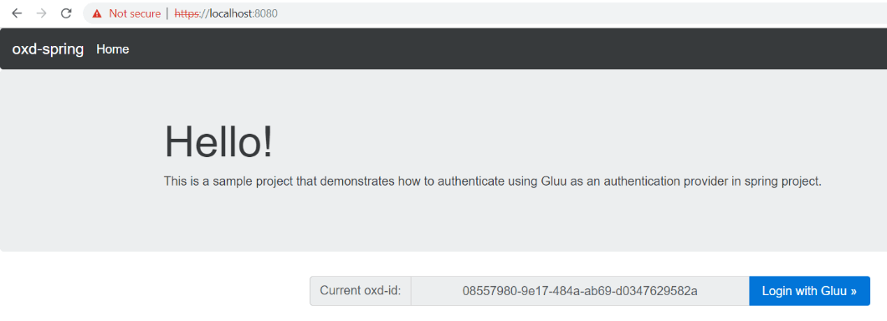
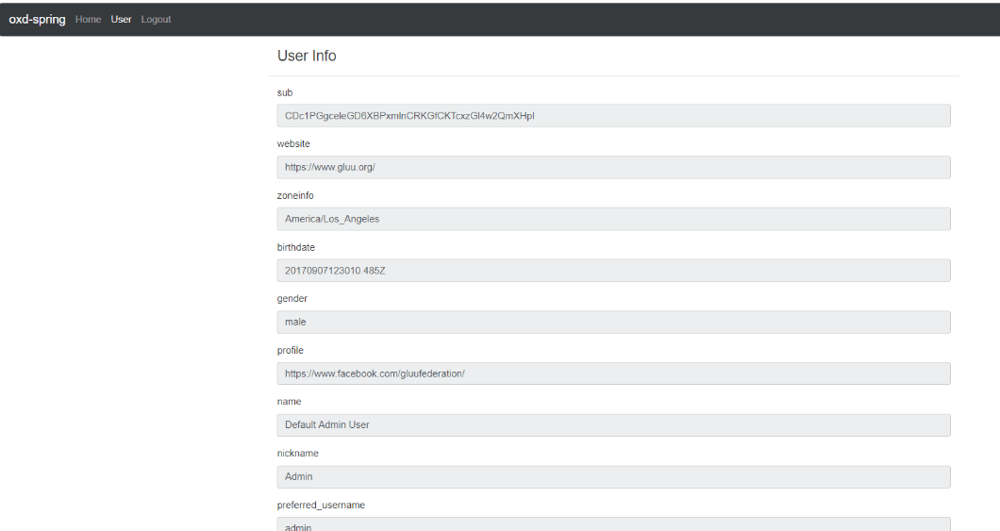

# oxd-spring <!-- intro -->

In this tutorial we demonstrate how a java spring web application can leverage oxd 4.2 for SSO using the authorization code flow.

!!! Attention
    For `oxd-4.x` and `oxd-spring` application running on different servers then it is essential to install and configure `SSL certificate by Certificate Authority` with oxd. This is required so that oxd-spring application can access oxd-server without throwing any ssl exception. But, if `oxd-spring` and `oxd-server` are running on same server then `oxd-spring` application will work even with `oxd` configured with `self-signed certificate`.
    
## Prerequisites

1. Java 8+

    Install [Java Standard Edition](http://www.oracle.com/technetwork/java/javase/downloads/2133151) version 8 or higher.

1. Maven 3+

    Download [maven](https://maven.apache.org/download.cgi) and follow the simple installation instructions. Ensure the `bin` directory is added to your PATH.

1. Install [Gluu Server bundled with oxd](../../install/index.md).

## Run

1. Ensure that Gluu server and oxd-server are running and accessible.

1. Clone `oxd-spring` project from [Github](https://github.com/GluuFederation/oxd-spring.git) to your local disk

    If you have `git` installed, just open a console and run below command to clone the project.

    ```
    git clone https://github.com/GluuFederation/oxd-spring.git
    ```
    
1. In the cloned `oxd-spring` project modify `${OXD_SPRING_HOME}\src\main\resources\application.properties` file to change the below configuration parameters:

    S.No. | Property Name | Property Description | Example
    ------|---------------|----------------------|---------
    1 | server.port | The port of running `oxd-spring` application. | server.port=8080
    2 | oxd.server.op-host | Provide the URL of your OpenID Provider (OP). | oxd.server.op-host=https://www.your-ophost.com
    3 | oxd.server.host | Hostname of oxd-server | oxd.server.host=www.your-oxd-server.com
    4 | oxd.server.port | Port of oxd-server | oxd.server.port=8443
    5 | oxd.server.acr-values | Comma separated preferred authentication methods. | oxd.server.acr- values=basic
    6 | oxd.server.scopes | Comma separated scopes that the client can use. | oxd.server.scopes=openid,profile,uma_protection,oxd
    7 | oxd.server.grant-types | Comma separated Grant Types that the client can use. | oxd.server.grant-types=authorization_code,client_credentials

1. Change directory to `${OXD_SPRING_HOME}` and run maven command to build the executable jar:

    ```
    cd oxd-spring 
    mvn clean package -Dmaven.test.skip=true
    ```

    Depending on connection speed and computer performance, it may take a couple of minutes to download all required dependencies and build the executable jar file.
    
1. Now you can run the executable jar using below command:

    ```
    java -jar target/oxd-spring-4.2-SNAPSHOT.jar
    ```

    The first time you run the application, it tries to register site using the parameters specified in [application.properties](https://github.com/GluuFederation/oxd-spring/blob/master/src/main/resources/application.properties). If registration was successful, then registration details and `oxdId` are stored in the H2 database (which is embedded in oxd-spring-4.2-SNAPSHOT.jar). Next time you run the application with the same [oxd.server.op-host](https://github.com/GluuFederation/oxd-spring/blob/master/src/main/resources/application.properties#L19), it will obtain `oxdId` from database.
    
1. Open a browser and point to https://localhost:8080/. This will display Home Page of oxd-spring application with `Login To Gluu` button. Click on the button to log into application using OAuth 2.0 security. 

    
    
1. After login the application will display information of the logged in user from OP. To Logout of application and click on `Logout` link on top menu. This will initiate the logout process and OP will make the browser return to a predefined [Post Logout Uri](https://github.com/GluuFederation/oxd-spring/blob/master/src/main/resources/application.properties#L27).

    
    
## Support

Please report technical issues and suspected bugs on 
our [Support Page](https://support.gluu.org/).
