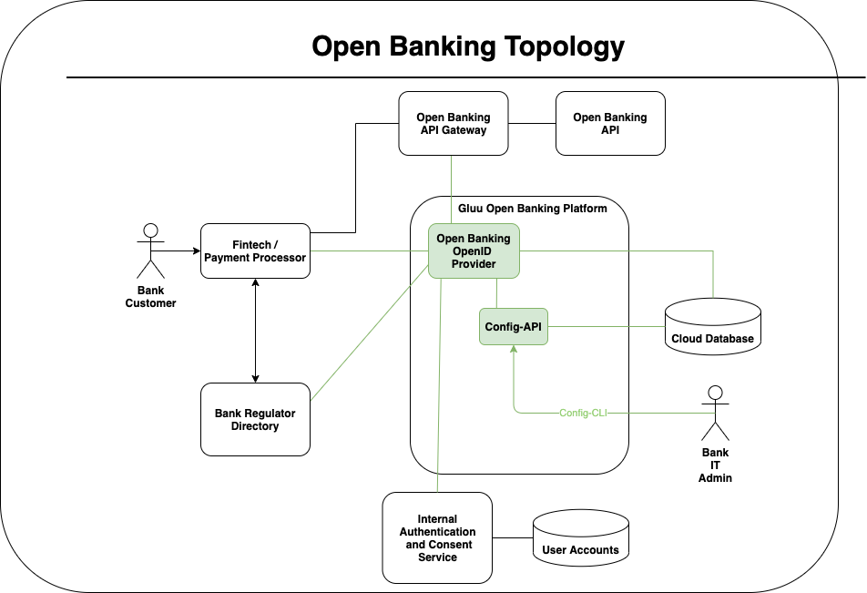

# Gluu Open Banking Identity Platform

## Overview

The Gluu Open Banking Identity Platform is a specific profile of the [Gluu Server](https://gluu.org/docs/gluu-server) that is packaged and configured for certain use cases:  

* Dynamic Client Registration using software statements  
* Payment Authorization  
* Identity - eKYC  
* Client Initiated Authentication (mobile / out of band)  

Other services needed by enterprises--but not by banks--have been disabled. The goal is to reduce the security surface area to make the platform easy to deploy, easy to keep up to date, and easy to rollout new features with zero downtime.

This is a cloud native distribution. Cloud native is essential for auto-scaling, high availability, and operational automation.

This distribution of Gluu is based on the Janssen Project at the Linux Foundation, which is a fork of Gluu Server 4, the [most certified](https://openid.net/certification) OpenID Platform available.

The core software is developed at the [Linux Foundation Janssen Project](https://jans.io).

## Components

* **Open Banking OpenID Provider**: Based on Janssen Auth Server, this is Internet facing component provides the FAPI OpenID Connect API for dynamic  client registration, transaction authorization, and CIBA.
* **Config API**: Service which configures the OpenID Provider. The Client must present an access token authorized by a trusted issuer with certain scopes.  
* **Cloud Database**: Database used to store configuration, client metadata, tokens, and other information required for the operation of the OpenID Provider.
* **Open Banking API Gateway**: An Internet facing gateway for the core open banking API, should enforce the presence of a token with certain scopes.
* **Open Banking API**: The core banking API.
* **Internal Authentication and Consent Service**: An OpenID Provider, SAML IDP, or another authentication service that provides access to actual customer information. This service may handle the consent, or delegate consent to another service.
* **User Accounts**: A database where the user account information is held
* **Bank Regulatory Directory**: This is hosted by the federation operator which publishes public key material and other metadata about participants in the open  banking ecosystem.
* **Fintech / Payment Processor**: A service that wants to call the Open Banking API or to get data or to process a payment.  

# PKI infrastructure

# Cloud Native Architecture

## Contribute
We want to keep improving our docs. Please help us improve by submitting any improvements to our [Documentation Github](https://github.com/GluuFederation/docs-open-banking-prod). If you're a Github pro, submit a pull request. If not, just open an issue on any typos, bugs, or improvements you'd like to see addressed. We need your help... even if you're not a coder, you can contribute!
