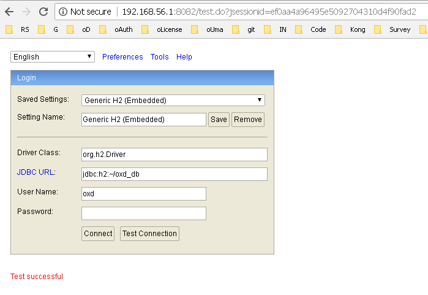
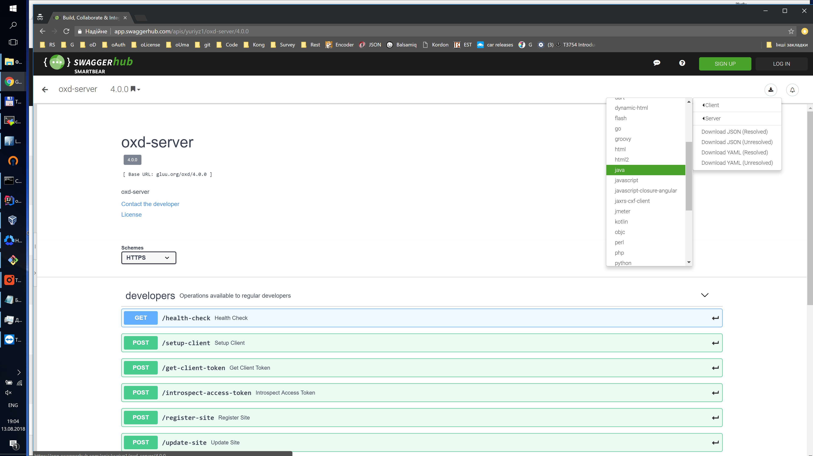

# Frequently Asked Questions (FAQ)

## General FAQs

### What is oxd?  
oxd is a mediator: it provides APIs that can be called by a web application more easily than directly calling the APIs of an OpenID Connect Provider (OP) or an UMA Authorization Server (AS).
 
### What types of applications can use oxd?       
Server-side web applications. 

### Why should I use oxd?     
oxd offers a few key improvements over the traditional model of embedding OAuth 2.0 code in your applications:

1. If new vulnerabilities are discovered in OAuth2/OpenID Connect, oxd is the only component that needs to be updated. The oxd APIs remain the same, so you don't have to change and regression test your applications     

2. oxd is written, maintained, and supported by developers who specialize in application security. Because of the complexity of the standards--and the liability associated with poor implementations--it makes sense to rely on professionals who have read the specifications in their entirety and understand how to properly implement the protocols     

3. Centralization reduces costs. By using oxd across your IT infrastructure for application security (as opposed to a handful of homegrown and third party OAuth2 client implementations), the surface area for vulnerabilities, issue resolution, and support is significantly reduced. Plus, you who have someone to call if something goes wrong!     


### Can I use oxd for two-factor authentication (2FA)?**    
No. 2FA is implemented at the OP, not the client.  

### What are the support options?    
Gluu offers community support and VIP support. Anyone can register and enlist community support on the [Gluu support portal](https://support.gluu.org). For guaranteed responses and priority support, learn more about [VIP support](https://gluu.org/pricing). 

### How do I get SSO across several websites?                
You’ll need two things:     

1. A central OpenID Connect Provider (OP) that holds the passwords and user information  

2. Websites that use the OpenID Connect protocol to authenticate users

An easy way to accomplish the first--install and configure the [free open source Gluu Server](http://gluu.org/docs/ce) using the Linux packages for CentOS, Ubuntu, Debian or Red Hat. Or you can also utilize Google as your OpenID Connect Provider (OP). The second is accomplished by calling the oxd APIs in your applications to send users to the OP for login. 

### Can I use oxd plugins for social login?   
oxd simply makes it easy to send users to an OpenID Connect Provider (OP) for login. If you want to offer users the option to use social login, that needs to be implemented at the OP. If you are using the Gluu Server as your OP, you can use [Passport.js](https://gluu.org/docs/ce/authn-guide/passport/) to configure and support social login. 

### Can I use oxd for two-factor authentication (2FA)?    
Again, since oxd simply makes it easy to send users to an OpenID Connect Provider (OP) for login, two-factor authentication needs to be enforced at the OP. If you are using the Gluu Server as your OP, there are several built in two-factor authentication mechanisms. Learn more in the [Gluu Server authentication guide](https://gluu.org/docs/ce/3.1.4/authn-guide/intro/).

### Can I use Google or Microsoft Azure Active Directory as my OpenID Connect Provider?    
We have tested and confirmed oxd to work with Google as an OP. Microsoft's OP implementation is not totally standard though, and therefore may require changes or updates to oxd to work. 

### Can I purchase support for the Gluu Server or oxd?
Yes, for information on paid support, [visit our website](http://gluu.org/pricing).

## Technical FAQs

### The `/get-tokens-by-code` command fails with a `No response from operation` error

This can happen if the `code` lifetime in `oxauth` server is very small and the `code` expires before token can be obtained. So in the logs, you'll see something like this:

```
2018-04-05 14:30:32,530 ERROR [org.xdi.oxd.server.op.GetTokensByCodeOperation] Failed to get tokens because response code is: null
2018-04-05 14:30:32,530 ERROR [org.xdi.oxd.server.Processor] No response from operation. Command: Command{command=GET_TOKENS_BY_CODE, params={"code":"cc36672e-f8b9-4958-9a7c-3d83c99c4289","state":"us7d1v37cn1fcsd1c0156adr16","oxd_id":"055cec18-bd2e-4b29-ae38-7428d1d7c7fb"}}
```

To fix it, increase the `authorizationCodeLifetime` oxauth configuration value as explained [here](https://gluu.org/docs/ce/admin-guide/oxtrust-ui/#oxauth-configuration).

### `oxd-server` does not work because of a PROTECTION error.

If you see output in the logs similar to what is shown below, it means that the `uma_protection` scope is disabled for dynamic registration on the `oxauth` side.
Find the `uma_protection` Connect scope property `Allow for dynamic registration`, and make sure it is checked (set to true). Find more information about scopes [here](https://gluu.org/docs/ce/admin-guide/openid-connect/#scopes)
 
```
2018-04-04 20:03:24,855 ERROR [org.xdi.oxd.server.service.UmaTokenService] oxd requested scope PROTECTION but AS returned access_token without that scope, token scopes :openid
2018-04-04 20:03:24,855 ERROR [org.xdi.oxd.server.service.UmaTokenService] Please check AS(oxauth) configuration and make sure UMA scope (uma_protection) is enabled.
2018-04-04 20:03:24,855 TRACE [org.xdi.oxd.server.service.IntrospectionService] Exception during access token introspection.
java.lang.RuntimeException: oxd requested scope PROTECTION but AS returned access_token without that scope, token scopes :openid
	at org.xdi.oxd.server.service.UmaTokenService.obtainTokenWithClientCredentials(UmaTokenService.java:196)
	at org.xdi.oxd.server.service.UmaTokenService.obtainToken(UmaTokenService.java:169)
```
### `oxd-server` unable to find valid certification path to requested target.

```
ERROR [2020-12-23 07:05:29,164] org.gluu.oxauth.client.OpenIdConfigurationClient: sun.security.validator.ValidatorException: PKIX path building failed: sun.security.provider.certpath.SunCertPathBuilderException: unable to find valid certification path to requested target
...
! Causing: sun.security.validator.ValidatorException: PKIX path building failed: sun.security.provider.certpath.SunCertPathBuilderException: unable to find valid certification path to requested target
...
! Causing: javax.net.ssl.SSLHandshakeException: sun.security.validator.ValidatorException: PKIX path building failed: sun.security.provider.certpath.SunCertPathBuilderException: unable to find valid certification path to requested target
! at sun.security.ssl.Alerts.getSSLException(Unknown Source)
...
```

The above error happens because oxd trust store file does not trust the CA of the Openid provider (OP). If you see the output in the logs similar to what is shown below, check the following:

- `trust_store_path` in `oxd-server.yml` is correct and points to correct truststore file.
- `trust_store_password` in `oxd-server.yml` should have correct password of the truststore file.
- The truststore file should have OP's root certificate. This can be verified using below `keytool` command or by using tools like [Keystore Exploler](https://keystore-explorer.org/). Import the OP certificate into truststore if not present.

| Command | Description |
|----------|------------|
| `keytool -v -list -keystore <truststore_file>.keystore` | Details of certificates persent in the truststore file |
| `keytool -import -file <op_root_cert>.pem -alias <alias_name> -root -keystore <truststore_file>.keystore` | Importing certificate into the truststore file |

- If required then `trust_all_certs` field can be set to `true` in `oxd-server.yml` to trust all certificates.

### How can I view data inside oxd database manually without oxd-server? 

By default, the oxd-server persists data inside H2 embedded database. On your disk, it should look like an `oxd_db.mv.db` file.
You can use any convenient database viewer to view/edit data inside the database. We recommend to use the browser-based viewer H2:

 - Download http://www.h2database.com/html/download.html
 - Run it (in "Platform-Independent zip" case it is as simple as hitting `h2.sh` or `h2.bat`)
 
 In the browser, you will see connection details; please specify details as in `oxd-conf.json` file.
 If all is filled correctly, upon "Test Connection" you should see a "Test successful" message like in the screenshot below:
 
 
 
 After hitting the "Connect" button, you will be able to view/modify data manually. Please be careful not to corrupt the data inside. Otherwise, oxd-server will not be able to operate in its normal mode.
 
### Client expires, how can I avoid it?

The only way to avoid client expiration is to change client life time on OP. Only OP controls client life time. 

### How can I use oxd with AS that does not support UMA ?
Please set `uma2_auto_register_claims_gathering_endpoint_as_redirect_uri_of_client` in `oxd-config.json` to "fails." Otherwise, you may get `no_uma_discovery_response` if UMA is not supported on the AS side.

### I got a `access_token_insufficient_scope` error when calling oxd-server. It worked perfectly in 3.1.x. What should I do ?
Since `3.1.4` we have forced users to have the `oxd` scope associated with `access_token`. If it is not present, then oxd rejects the calls.
 
  - Make sure you have the `oxd` scope present on AS
  - the `oxd` scope is present during the `/register-site` command in the `scope` field
  - the `oxd` scope is present during the `/get-client-token` command in the `scope` field

### I got a `Failed to obtain PAT.` error in oxd-server.log. How can I solve it?

During client registration (via `/register-site` command) make sure that you have `client_credentials` as value of `grant_type`. Without it oxd will not be able to obtain UMA PAT because it is using client credentials for it (e.g. grant_type: [`client_credentials`, `authorization_code`]).

### What is the easiest way to generate native library for oxd?

oxd has defined swagger specification [here](https://github.com/GluuFederation/oxd/blob/version_4.1.beta/oxd-server/src/main/resources/swagger.yaml). It is possible to generated native library in your favorite language by [Swagger Code Generator](https://swagger.io/tools/swagger-codegen/)

You can easily generate appropriate client via https://app.swaggerhub.com GUI, just add swagger spec and in upper right corner it's possible to download client as shown below:


